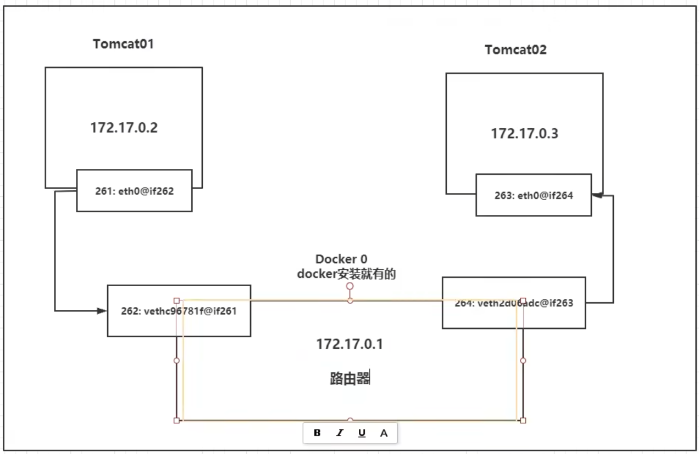

> # ***Docker***
- [**基本步骤**](#基本步骤)
- [**学习资料**](#学习资料)
  - [**笔记**](#笔记)
  - [**Docker常用命令**](#docker常用命令)
  - [**Docker容器数据卷**](#docker容器数据卷)
  - [**Dockerfile**](#dockerfile)
  - [**docke网络**](#docke网络)
  - [**docker compose**](#docker-compose)
    - [概念](#概念)
    - [使用](#使用)
  - [**docker Portainer**](#docker-portainer)
  - [**CIG**](#cig)


# **基本步骤**
- dockerfile : 构建文件，定义了一切的步骤，源代码，命令脚本
- dockerimages : 通过 dockerfile 构建生成的镜像，最终发布和运行的产品
- docker容器 : 容器就是镜像运行起来提供服务的
#  **学习资料**
- [x] Docker学习视频  
        [b站 Docker基础知识](https://www.bilibili.com/video/BV1og4y1q7M4?p=23&vd_source=41cf0bf8fd5d0fd2788aa7ff7dd66abc)  
        [b站 Docker进阶知识](https://www.bilibili.com/video/BV1kv411q7Qc/?spm_id_from=333.999.0.0&vd_source=41cf0bf8fd5d0fd2788aa7ff7dd66abc)
        [b站 尚硅谷Docker实战教程](https://www.bilibili.com/video/BV1gr4y1U7CY?p=90&spm_id_from=pageDriver&vd_source=41cf0bf8fd5d0fd2788aa7ff7dd66abc)
- [x] 常用网站  
    [Docker HUB](https://hub.docker.com/)
    [Docker portainer](https://www.portainer.io/)
## **笔记**
- [x] Docker常用命令
- [x] Dockerfile
- [x] Docker网络
- [x] Docker-compose
- [x] Docker Portainer
- [ ] CIG(CAdvisor+InfluxDB+Granfana)
 ## **Docker常用命令**
 1. ### **帮助类启动命令**
    - *启动docker*  
    `systemctl start docker`
    - *停止docker*  
    `systemctl stop docker`
    - *重启docker*  
    `systemctl restart docker`
    - *查看docker状态*  
    `systemctl status docker`
    - *开机启动*  
    `systemctl enable docker`
    - *查看docker概要信息*  
    `docker info`
    - *查看docker总体帮助文档*  
    `docker --help`
    - *查看docker命令帮助文档*  
    `docker 具体命令 --help`   
1. ### **镜像命令**
    - *查看本地镜像*  
        `docker images`  
        ```
        -a:列出本地所有的镜像（含历史镜像层）
        -q:只显示镜像ID
        ```
    - *搜索镜像*  
        `docker search [OPTIONS] 镜像名字/id`
        ```
        --limit:只列出N个镜像，默认25个
        ```
    - *从仓库拉取镜像*  
        `docker pull 镜像名字/id :[TAG]`
        ```
        不写TAG默认拉去最新版，等价于docker pull 镜像名字:latest
        ```
    - *查看镜像/容器/数据卷所占的空间*  
        `docker system df `
    - *删除镜像*  
        `docker rmi 镜像名字/id`   
        |  操作 |  命令  |  
        | :-----------: | ----------- |  
        | 删除单个 | `docker rmi -f 镜像id` |  
        | 删除多个 | `docker rmi -f 镜像id1:TAG  镜像id2：TAG ...`
        | 删除全部 | `docker rmi -f $(docker image -qa)` 
    - *查看镜像构建历史*  
        `docker history 镜像名字/id` 
2. ### **容器命令**
    - *创建容器*  
    `docker run [OPTIONS] image [COMMAND] [ARGS...]` 
        | OPTIONS    |    <center>作用   | 
        | :-----------: | ----------- |
        | `--name` |  为容器指定一个名称 |
        | `-d`     | 后台运行容器并返回容器id，也即启动守护式容器（后台运行）|
        | `-i`     | 以交互模式运行容器，通常与`-t`一起使用 |
        | `-t `    | 为容器重新分配一个伪输入终端。通常与`-i`一起使用，也即启动交互式容器（前台有伪终端等待交互） |
        | `-P`     | 随机端口映射，大写P | 
        | `-p `    | 指定端口映射，小写p |
        | `--gpus` |   在容器中能够使用的gpu，一般 `--gpus=all` |
        | `-net`   | host模式：使用 `--net=host` 指定。（使用本地主机IP）<br>none模式；使用 `--net=none` 指定。<br>bridge模式：使用 `--net=bridge` 指定，默认设置。<br>container模式：使用 `--net=container:NAME_or_ID` 指定 |  
        | `--restart` |   `--restart=no` 默认值，表示容器退出时，docker不自动重启容器<br>`--restart=on-failure:n `若容器的退出状态非0，则docker自动重启容器，还可以指定重启次数n，若超过指定次数未能启动容器则放弃<br>`--restart=always` 容器退出时总是重启<br>`--restart=unless-stopped` 容器退出时总是重启，但不考虑Docker守护进程启动时就已经停止的容器


    - *查看容器*   
    `docker ps [OPTIONS]`
        | OPTIONS    |    <center>作用   |
        | :-----------: | ----------- | 
        | `-a` | 列出当前所有正在运行的容器和历史上运行过的 |
        | `-l` | 显示最近创建的容器 |
        | `-n` | 显示最近创建的n个容器 |
        | `-q` | 静默模式，只显示容器编号 |
    - *启动停止运行的容器*  
    `docker start 容器名/ID`
    - *重启容器*   
    `docker restart 容器名/ID` 
    - *停止容器*  
    `docker stop 容器名/ID` 
    - 强制停止容器  
    `docker kill 容器名/ID` 
    - *进入正在运行的容器并以命令行交互*  
        1. `docker exec -it 容器名/ID bashshell `  
            ```
            exec 是在容器中打开新的终端，并且可以启动新的进程，用exit退出，不会导致容器的停止
            ```
        2. `docker attach 容器名/ID`  
            ```
            attach直接进入容器启动命令的终端，不会启动新的进程，用exit退出会导致容器的停止
            ```      
    - *两种退出容器方式*
        | 方式 | <center>效果 |
        | :----: | ---- | 
        |`exit`         | run进入容器，exit退出，容器停止 |
        |`ctrl`+`p`+`q` | run进入容器，ctrl+p+q退出，容器不停止|
    - *删除已停止的容器*  
    `docker rm 容器名/ID` 
    - *查看容器内部细节*  
    `docker inspect 容器名/ID` 
    - *查看容器日志*  
    `docker logs 容器名/ID`  
        进不去容器可以查看日志报错信息
    - *查看容器内运行的进程*  
    `docker top 容器名/ID` 
    - *容器与主机文件拷贝*  
    `docker cp 容器名/ID:path 本地主机path`  
    `docker cp 本地主机path 容器名/ID:path`
    - *导出容器的内容作为一个tar归档文件（对应import命令）*  
    `docker export 容器名/ID > 文件名.tar` 
    - *从tar包中创建一个新的文件系统再导入为镜像（对应export命令）*
    `cat 文件名.tar | docker import - 镜像用户/镜像名:TAG` 
   
 ## **Docker容器数据卷**
1. ### *什么是容器数据卷*
    容器数据卷是一种数据共享技术，Docker中产生的数据同步到本地。  
    目录的挂载，将容器内的目录，挂载到宿主机上。  
    容器的持久化和同步操作，以及容器间的数据共享。
2. ### *匿名挂载和具名挂载*  
    查看所有的 volume 的情况  
    `docker volume ls `   
    `docker inspect 容器名/ID` 找到 `mount` 查看挂载详情  
    匿名挂载（不指定容 器外路径）  
    `docker run -d  -v /etc/xxx 镜像名/id`  
    具名挂载（指定容器外路径）  
    `docker run -d  -v 卷名:/etc/xxx 镜像名/id`   
    所有 docker 容器内的卷，没有指定目录的情况下都是在 `/var/lib/docker/volume/xxx/_data  ` 目录下  
    指定具体目录挂载  
    `docker run -d  -v /宿主机路径:/etc/xxx 镜像名/id`  
    扩展  
    ```bash
    # 通过 -v 容器内路径: ro  rw 改变读写权限 
    docker run -d  -v 卷名:/etc/xxx:ro 镜像名/id  # ro 只能通过宿主机改变
    docker run -d  -v 卷名:/etc/xxx:rw 镜像名/id
    ```
3. ### *通过 dockerfile 挂载*
    ```docker
    # 在 dockerfile 中添加一层 VOLUME 来指定添加容器数据卷
    # 匿名挂载
    VOLUME ["volume1", "volume2"]

    # 构建镜像时没有指定挂载卷，才会在创建时手动 -v 指定挂载数据卷。
    
    ```
 ## **Dockerfile**
>> dockefile 就是用来构建 docker 镜像的构建文件！命令脚本！ 

[Docker HUB](https://hub.docker.com/) 中99%的镜像都是从这个基础镜像过来的 `FROM scrath` ，再此基础上添加需要的软件和配置
1. ### *基础知识*   
    - 每个保留关键字（指令）必须大写
    - 执行顺序从上到下 
    - \# 表示注释
    - 每个指令都会创建用一个新的镜像层，并提交
      
2. ### *dockerfile 的指令*
    ```docker
    FROM         # 指定基础镜像，一切开始的地方
    MAINTAINER(已弃用，官方推荐使用 LABEL)   # 镜像是谁写的，姓名+邮箱
    LABEL        # 给镜像添加标签，一个镜像可以有多个标签，使用键值对的方式指定,可以使用如下方式查看标签
    docker image inspect --format xxx
    docker image inspect --format='xxx' xxx
    RUN          # 镜像运行时需要运行的命令
    ADD          # 在容器里添加内容
    WORKDIR      # 进入镜像时的工作目录
    VOLUME       # 指定挂载的目录 如果不写可以在创建容器时 -v 指定
    EXPOSE       # 暴露的端口，如果不写可以在创建容器时 -p  指定
    CMD          # 指定容器启动时要运行的命令，只有最后一个会生效，可被替代
    ENTRYPOINT   # 指定容器启动时要运行的命令,可以追加命令
    ONBUILD      # 当构建一个被继承的 dockerfile 这个时候就会运行 ONBUILD 指令，触发指令
    COPY         # 类似ADD。将文件拷贝到镜像中
    ENV          # 构建的时候设置环境变量，键值对的形式
    ```
    > *一个简单的dockerfile实例*
    ```docker
    # dockerfile
    FROM ubuntu:22.04              
    LABEL author=LostmanMing

    ENV ENTRYPATH /usr/local
    WORKDIR $ENTRYPATH

    RUN apt install vim && apt install tree
    RUN apt install net-tools

    EXPOSE 80 

    CMD echo $ENTRYPATH
    CMD /bin/bash        # CMD 一次只能执行一个命令

    # shell
    docker build -f dockerfile -t myubuntu:v1 .

    docker history myubuntu:v1  # 查看镜像构建过程
    ```
    > *CMD 和 ENTRYPOINT 的区别*  
    

    CMD 只有最后一个命令会执行，不能追加命令
    ```docker
    # 测试CMD
    CMD ["ls", "-a"]  # 可以执行
    docker run xxx -l # 追加命令时报错，本意为 ls -al, 但使用 CMD 会让 -l 覆盖 ls -a 命令， -l 不是命令故报错

    # 测试 ENTRYPOINT
    ENTRYPOINT ["ls", "-a"]
    docker run xxx -l       # 可以运行，并且启动后执行 ls -al

    ```

     
  
 ## **docke网络**
  每启动一个容器，docker就会给容器分配一个ip，安装docker，就会有一个默认网卡 docker0，桥接模式，使用的技术是 veth-pair。
- veth-pair

    ```shell
    # 容器带来的网卡都是一对一对的
    # veth-pair 就是一对的虚拟设备接口，他们是成对出现的，一端连接这协议，一端彼此相连
    # 正因有这个特性，veth-pair 常常充当一个桥梁，连接各种虚拟网络设备
    ```
    
    docker使用的是linux的桥接，宿主机中是一个docker容器的网桥 docker0，大约能分配255*255-n个(255.255.0.0)
    
    docker中所有的网络接口都是虚拟的，虚拟转发效率高（内网传文件） 
    删除容器时，对应网桥消失。
- 容器互联 `--link`  （不建议使用）
    容器内想通过容器名ping通另一个容器
    `docker run -d --link xxx  xxxx`  单向联通  
    `--link` 就是在/etc/hosts中增加了 目标容器ip 和 容器名/id 之间的映射  
    不建议使用的原因：  
    自定义网络不适用docker0  
    docker0的问题：域名不能访问,即不支持容器名连接访问。
- 自定义网络  
    查看所有的 docker网络  
    `docker network ls `  
    ```bash
    $ docker network ls
    NETWORK ID          NAME                DRIVER
    7fca4eb8c647        bridge              bridge
    9f904ee27bf5        none                null
    cf03ee007fb4        host                host
    ```  
    **网络模式**  
    | 模式      | <center> 作用 </center>   |
    |  :---:    |  ---   |
    | bridge    | --net=bridge ,默认设置|
    | none      |  --net=none ,不配置网络|
    | host      | --net=host ,和宿主机共享网络|
    | container | --net=container:NAME_or_ID ,容器间网络联通 （用的少）|
    | 自定义名   | --net=自定义名 |

    **自定义网络 （推荐）** 
    ```bash
    # 创建
    docker network create --driver bridge --subnet 192.168.0.0/16 gateway 192.168.0.1 mynet
    # 查看
    docker network ls
    docker network inspect mynet 
    # 使用
    docker run -d --net mynet --name xxx   x
    docker run -d --net mynet --name xxxx  x
    # 测试
    docker exec -it xxx ping xxxx    # 可以通过容器名 ping通，不需要 --link
    ```
    自定义网络自己维护使用它的docker的对应关系

    **网络联通**   
    需要跨网段操作时使用  
    当一个容器 `xx` 想联通一些运行在自定义网络 `mynet` 的容器，需要使用 `connect` 命令  
    `docker network connect mynet xx`  
    此时查看  
    `docker network inspect mynet`  
    发现这样会给 `xx` 分配一个 `mynet` 的地址，实现一个容器两个ip


 ## **docker compose**
### 概念
是docker官方的开源项目，实现对单机docker容器的快速编排  

[官方文档](https://docs.docker.com/compose/compose-file/compose-file-v3/)  
- 一文件
    `docker-compose.yml`
- 两要素
    1. 服务 
        一个个应用容器实例
    2. 工程
        由一组关联的容器组成的一个完整的业务单元，在 `docker-compose.yml` 文件中定义
### 使用
***三个步骤***
- 编写 `dockerfile` 定义各个应用并构建对应的镜像文件
- 使用 `docker-compose.yml` 定义一个完整的业务单元，安排好整体应用的各个容器服务
- 执行 `docker-compose up` 命令来启动并运行整个应用程序，完成一键部署上线

    >***compose常用命令***
    `docker-compose -h`     # 查看帮助
    `docker-compose up`     # 启动所有docker-compose服务
    `docker-compose up -d`  # 启动所有docker-compose服务并后台运行
    `docker-compose down`   # 停止并删除容器、网络、卷、镜像。
    `docker-compose exec`  yml里面的服务id            # 进入容器实例内部  
      etc. `docker-compose exec docker-compose.yml文件中写的服务id /bin/bash`
    `docker-compose ps`     # 展示当前docker-compose编排过的运行的所有容器
    `docker-compose top`    # 展示当前docker-compose编排过的容器进程
    `docker-compose logs  yml里面的服务id`     # 查看容器输出日志
    `docker-compose config`     # 检查配置
    `docker-compose config -q`  # 检查配置，有问题才有输出
    `docker-compose restart`   # 重启服务
    `docker-compose start`     # 启动服务
    `docker-compose stop`      # 停止服务


 ## **docker Portainer**
可以监控容器的轻量级可视化工具
-  [安装地址](https://docs.portainer.io/start/install/server/docker/linux)

 ## **CIG**
CAdvisor监控收集 + InfluxDB存储数据 + Granfana展示图表