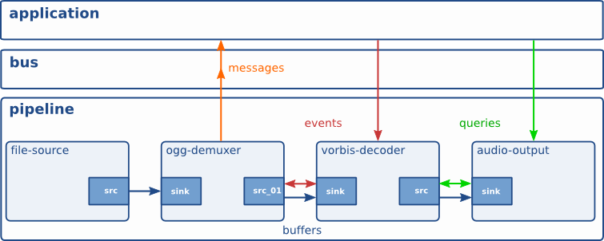

<div align='center'>
  <h1>GStreamer笔记</h1>
</div>

# 基础概念
## Initializing GStreamer
- 使用 `gst/gst.h` 头文件包含 GStreamer 库函数。
- GStreamer库在使用前需要先初始化：`gst_init` ，这个函数将执行库的必要初始化以及解析 GStreamer 特定的命令行选项。  
- `gst_init (NULL, NULL)` 表示不解析任何命令行参数。
- `gst_version` 获取您的应用程序所链接的 GStreamer 版本  
    例子
    ```c
    #include <stdio.h>
    #include <gst/gst.h>
    int main (int   argc, char *argv[]){
        const gchar *nano_str;
        guint major, minor, micro, nano;
        gst_init (&argc, &argv);    //初始化库以及接收命令行参数
        gst_version (&major, &minor, &micro, &nano);
        if (nano == 1)
            nano_str = "(CVS)";
        else if (nano == 2)
            nano_str = "(Prerelease)";
        else
            nano_str = "";
        printf ("This program is linked against GStreamer %d.%d.%d %s\n",
                major, minor, micro, nano_str);
        return 0;
    }
    ```

## Elements
- 元素是构成管道以及其他高级组件的基础，输入数据经过元素的处理，输出各种解码数据。
- 元素包括源元素（Source elements）、滤波器（Filters）和其他类滤波器元素（Filter-like elements）以及接收元素（Sink elements）。
### Source elements
- 源元素生成供管道使用的数据，它包含一个 `src pad` , 一般将他展示在元素的右边。  
- 源元素不接受数据，只生成数据。
    <center>

    
    </center>
### Filters, convertors, demuxers, muxers and codecs
- 滤波器和其他类滤波器同时具有 `src pad` 和 `sink pad`,他们将输入到自身`sink pad`上的数据进行操作，并将其输出到自身`src pad`。
- 类过滤器元素可以有任意数量的`src`或`sink`，比如将输入的音视频，拆分为音频和视频两个部分。
    <center>

       
    
    </center>
### Sink elements
- 接收元素是管道的终点，它们只接收数据但不产生任何数据
- 磁盘写入、声卡播放和视频输出都将由接收器元素实现。
    <center>

    
    </center>
### 元素工厂
- 元素工厂是GStreamer中的一个基础组件，它用于创建和管理GStreamer元素。通过元素工厂，我们可以方便地创建各种类型的媒体处理元素，从而构建我们所需的应用程序。
- GStreamer提供了许多内置的元素工厂，可以用于创建常见的媒体处理元素，例如音频解码器、视频编码器、文件读取器等。此外，我们还可以编写自定义元素工厂来创建自己的媒体处理元素。
- 使用元素工厂最方便的一点是，它包含了元素能够生成的 `pad` 的完整描述，以及这些 `Pad` 的能力（也就是说，能够在这些 `pad` 的上传输的媒体的类型），而无需将这些插件加载到内存中。
- 对于`pad`，后面有更详细的介绍。
  
### 创建元素
- 使用 `gst_element_factory_make ()` 创建一个元素
- 此函数接收一个`工厂名称（factory name）` 以及一个 `元素名称（element name）`, 工厂名称为库中定义的，元素名称是自定义名称。
- 元素名称可用于后续在容器中查找元素。该名称还将用于调试输出。
- 该函数的返回值可以判断元素是否创建成功。
- 当不需要某个元素时，使用 `gst_object_unref ()` 取消引用，它会将元素的引用计数减 1。元素在创建时的引用计数为 1。当引用计数减少到 0 时，元素将被完全销毁。
    ```c
    #include <gst/gst.h>
    int main (int argc,char *argv[]){
        GstElement *element;

        /* 初始化GStreamer */
        gst_init (&argc, &argv);

        /* 创建元素 方式1*/
        element1 = gst_element_factory_make ("fakesrc", "source");
        if (!element1) {
            g_print ("Failed to create element1 of type 'fakesrc'\n");
            return -1;
        }

        /* 创建元素 方式2*/
        factory = gst_element_factory_find ("fakesrc");
        if (!factory) {
            g_print ("Failed to find factory of type 'fakesrc'\n");
            return -1;
        }
        element2 = gst_element_factory_create (factory, "source");
        if (!element2) {
            g_print ("Failed to create element2, even though its factory exists!\n");
            return -1;
        }

        //释放资源
        gst_object_unref (GST_OBJECT (element1));   
        gst_object_unref (GST_OBJECT (element2));
        gst_object_unref (GST_OBJECT (factory));
        return 0;
    }
    ```
- `gst_element_factory_make` 实际上是两个函数的组合，`gst_element_factory_find () + gst_element_factory_create ()`。
- `gst_element_factory_find ()` 用于通过工厂名创建 `GstElementFactory` 元素。
- `gst_element_factory_create ()` 使用上一步的元素工厂创建给定名称的元素。

### 使用元素
- `GstElement` 继承自 `GObject` ，因此支持 `GObject` 查询、设置和获取属性值的常用方法。
- 每个 `GstElement` 至少从其父类继承一个 `name` 属性，它是使用`gst_element_factory_make ()` 时提供的。
- 可以使用函数获取和设置此属性 `gst_object_set_name`，`gst_object_get_name`或者使用`GObject` 如下所示的属性机制。
    ```c
    #include <gst/gst.h>

    int main (int   argc, char *argv[]){
        GstElement *element;
        gchar *name;
        /* 初始化GStreamer */
        gst_init (&argc, &argv);
        /* 创建元素*/
        element = gst_element_factory_make ("fakesrc", "source");
        /* get name */
        g_object_get (G_OBJECT (element), "name", &name, NULL);
        g_print ("The name of the element is '%s'.\n", name);
        //释放资源
        g_free (name);
        gst_object_unref (GST_OBJECT (element));
        return 0;
    }
    ```
### 元素链接
- 通过将源元素与零个或多个类过滤器元素以及最终的接收器元素链接起来，才可以设置一个媒体管道。
<center>


</center>

- `gst_bin_add_many` 可以将多个元素放在一个管道中，但这并不代表管道中的元素已经被链接了，因为他们有无数种组合方式。链接的目的就是将这些元素，组成一个媒体流可以传输的管道。
- `gst_element_link_many` 根据传入的元素的顺序，自动将相邻元素的 `src pad` 和 `sink pad`连接，最后 `NULL` 表示管道末尾。
- 上图的链接可以用下面的代码实现。
    ```c
    #include <gst/gst.h>
    int main (int   argc, char *argv[]) {
        GstElement *pipeline;
        GstElement *source, *filter, *sink;
        /* init */
        gst_init (&argc, &argv);
        /* create pipeline */
        pipeline = gst_pipeline_new ("my-pipeline");
        /* create elements */
        source = gst_element_factory_make ("fakesrc", "source");
        filter = gst_element_factory_make ("identity", "filter");
        sink = gst_element_factory_make ("fakesink", "sink");

        /* 在链接前，必须将元素先放进管道中 */
        gst_bin_add_many (GST_BIN (pipeline), source, filter, sink, NULL);

        /* 链接 */
        if (!gst_element_link_many (source, filter, sink, NULL)) {
            g_warning ("Failed to link elements!");
        }
        [..]
    }
    ```
- 除了这种整体链接，还有更具体的连接方式，如 `gst_element_link ()` / `gst_element_link_pads ()` 等。
  
### 元素状态
- 创建元素后，元素实际上还不会执行任何操作。需要更改元素状态以使其执行某些操作。
- GStreamer 有四种元素状态：
    - `GST_STATE_NULL`：默认状态。元素还没有被初始化或还没有被连接到管道中。此状态下未分配任何资源，因此，转换到该状态将释放所有资源。当元素的引用计数达到 0 并被释放时，该元素必须处于此状态。
    - `GST_STATE_READY`：就绪状态。元素已经被初始化，并且可以分配资源和创建线程，但是还没有开始处理数据流。在这个状态下，元素可以设置其属性，预分配缓冲区等等。
    - `GST_STATE_PAUSED`：暂停状态。元素已经准备好接受数据，并且可以处理数据流，但是还没有开始向下游元素传递数据。在这个状态下，元素会为其缓冲区分配更多的资源，以便更好地处理数据。不允许使用让时钟运行的操作。PAUSED 与 PLAYING 相同，但没有运行时钟。
    - `GST_STATE_PLAYING`：播放状态。元素正在处理数据流，并且正在向下游元素传递数据。在这个状态下，元素已经分配了其最大的资源，以最大限度地处理数据。并且时钟正在运行。
- 可以使用 `gst_element_set_state ()` 为元素或管道中的所有元素设置状态，但状态不会从一个状态直接转变到另一个，他会在两种状态之间的所有状态依次转换。
- 在 `GST_STATE_PLAYING` 状态下，管道将自动处理数据，并在内部开启线程播放。
- 当您将 `bin` 或管道设置为某个目标状态时，它通常会自动将状态更改传播到 bin 或管道内的所有元素，因此通常只需要设置顶层管道的状态即可启动管道或将其关闭。
- 当将元素动态添加到已经运行的管道时，它的状态不会跟随管道状态，需要手动设置，`gst_element_set_state ()`，`gst_element_sync_state_with_parent ()`。

## Bins
- `bin` 是元素的容器，可以将元素添加到 `bin` 中，`bin` 自身也是元素。
- 将一组链接起来的元素组合成一个逻辑元素，这个元素就是 `bin`。
- 有了 `bin`，就不需要依次对单个元素处理，只需处理一个 `bin` 元素即可。
- `bin` 还将管理其中包含的元素。它将对元素执行状态更改以及收集和转发 `bus` 总线消息。
<center>


</center>

- `pileline` 管道是一种特殊的 `bin`,是管理所包含元素的同步和总线消息的通用容器。顶层 `bin` 必须是管道，因此每个应用程序都至少需要一个。
### 创建bin
- 容器创建 `gst_bin_new ()`, `gst_pipeline_new ()`。
- 元素添加到容器中或从容器中移除元素 `gst_bin_add ()`, `gst_bin_remove ()`。
    ```c
    #include <gst/gst.h>
    int main (int argc, char *argv[]) {
        GstElement *bin, *pipeline, *source, *sink;
        /* init */
        gst_init (&argc, &argv);
        /* create */
        pipeline = gst_pipeline_new ("my_pipeline");
        bin = gst_bin_new ("my_bin");
        source = gst_element_factory_make ("fakesrc", "source");
        sink = gst_element_factory_make ("fakesink", "sink");
        /* 首先添加元素到容器中 */
        gst_bin_add_many (GST_BIN (bin), source, sink, NULL);
        /* 添加 bin 到管道中 */
        gst_bin_add (GST_BIN (pipeline), bin);
        /* link the elements */
        gst_element_link (source, sink);
        [..]
    }
    ```
## Bus
- 在GStreamer中，Bus是一个用于处理消息（`Message`）的系统组件。每个GStreamer元素（`Element`）都可以将不同类型的消息（例如错误、警告、状态变化等）发送到总线（`Bus`）中，而应用程序可以使用总线来监听这些消息并采取相应的行动。`Bus` 还可以用于控制元素的状态，例如启动、暂停、恢复等操作。
- 默认情况下，每个管道都会包含一个 `bus`, 因此不需要额外创建。
- `Bus` 由 `GstBus` 类实现，它是 `GObject` 类的子类。`Bus` 使用一种 发布/订阅 的模式，即元素发布消息，应用程序订阅消息。应用程序可以使用 `GstBus` 的方法来注册一个回调函数，该函数将在总线上接收到新消息时被调用。回调函数将接收到一个指向接收到消息的 `GstMessage` 结构体的指针，其中包含了有关消息类型、发送者、消息内容等信息。
- 可以使用 `GstBus` 的方法来控制元素的状态。例如，可以使用 `GstBus` 的 `gst_bus_sync_handler` 函数来等待特定的消息，然后根据消息类型来采取相应的行动。如果等待特定类型的消息，可以使用 `gst_bus_timed_pop_filtered` 方法。这些方法还可以设置超时时间，如果在指定时间内未接收到消息，则函数返回。
<center>


</center>

- 使用 `GstBus` 来监听 `GStreamer` 元素发来的消息，并采取相应的行动，基本步骤如下
    1. 获取 `GstBus` 对象，在 `GStreamer` 中，每个 `Pipeline` 都有一个关联的 `Bus`。可以使用 `Pipeline` 对象的 `get_bus` 方法来获取 `Bus` 对象。  
    `bus = gst_pipeline_get_bus(GST_PIPELINE(pipeline));`
    2. 注册一个回调函数来处理消息。
        ```c
        static gboolean bus_callback(GstBus *bus, GstMessage *message, gpointer user_data) {
            GMainLoop *loop = (GMainLoop*)user_data;
            switch (GST_MESSAGE_TYPE(message)) {
                case GST_MESSAGE_EOS:
                    g_print("End of stream\n");
                    g_main_loop_quit(loop);
                    break;
                case GST_MESSAGE_ERROR:
                    GError *err;
                    gchar *debug_info;
                    gst_message_parse_error(message, &err, &debug_info);
                    g_printerr("Error received from element %s: %s\n", GST_OBJECT_NAME(message->src), err->message);
                    g_printerr("Debugging information: %s\n", debug_info ? debug_info : "none");
                    g_error_free(err);
                    g_free(debug_info);
                    g_main_loop_quit(loop);
                    break;
                default:
                    break;
            }
            return TRUE;
        }
        ```
    3. 利用 `gst_bus_add_watch` 函数将回调函数注册到 `GstBus` 上：  
    `guint bus_watch_id = gst_bus_add_watch(bus, bus_callback, loop);`  
    这里的 `loop` 是一个 `GMainLoop` 对象，它是一个用于处理 `GStreamer` 消息循环的主循环。当管道启动并开始运行时，它会在主循环中监听来自 `GstBus` 的消息。当 `GstBus` 上收到消息时，它会调用注册的回调函数来处理消息。, 一般填 `NULL`,表示使用默认的 `GLib` 上下文, 而默认上下文是与主循环相关联的上下文。
    4. 在主循环中运行管道：  
    `g_main_loop_run(loop);`  
    在 `GStreamer` 应用程序中，主循环通常用于等待消息并响应这些消息。例如，在上述示例中，我们在主循环中运行 `g_main_loop_run(loop)` 函数，它将一直等待直到主循环退出。  
    `Bus` 的回调函数是在 `GStreamer` 的主循环中执行的。因此，我们需要运行主循环以便 `Bus` 能够处理消息。
    5. 当管道停止时，从 `GstBus` 中移除回调函数并释放资源：  
        ```c
        gst_bus_remove_watch(bus, bus_watch_id);
        gst_object_unref(bus);
        ```
- 完整实例如下
    ```c
    #include <gst/gst.h>
    int main(int argc, char *argv[]) {
        GstElement *pipeline;
        GstBus *bus;
        guint bus_watch_id;
        GMainLoop *loop;
        /* 初始化 GStreamer */
        gst_init(&argc, &argv);
        loop = g_main_loop_new(NULL, FALSE);
        /* 创建 pipeline */
        pipeline = gst_parse_launch("videotestsrc ! autovideosink", NULL);
        /* 获取和 pipeline 相关联的 bus */
        bus = gst_pipeline_get_bus(GST_PIPELINE(pipeline));
        /* 在总线上添加监听 */
        bus_watch_id = gst_bus_add_watch(bus, bus_callback, loop);
        /* Start the pipeline */
        gst_element_set_state(pipeline, GST_STATE_PLAYING);
        /* 运行主循环 */
        g_main_loop_run(loop);
        /* 释放资源 */
        gst_element_set_state(pipeline, GST_STATE_NULL);
        gst_bus_remove_watch(bus, bus_watch_id);
        gst_object_unref(bus);
        gst_object_unref(pipeline);
        g_main_loop_unref(loop);
        return 0;
    }
    ```
    ```bash
    #关于主循环和bus的补充
    在示例代码中，我们是在主循环中调用了 g_main_loop_run() 函数来运行 GStreamer 管道。实际上，这里的主循环指的是 GStreamer 应用程序中的主循环，而不是程序本身的主循环。

    GStreamer 库使用 GMainLoop 来处理异步事件和消息。当使用 GStreamer 库创建管道时，它将自动为您创建一个 GMainLoop 对象，并在其中运行管道。管道会在一个新的线程中启动，而 GMainLoop 会在主线程中运行。当管道发送消息时，它会将消息发送到主线程上的 GMainLoop 中，并调用注册的回调函数来处理消息。因此，在这种情况下，主循环确实会调用回调函数，同时也会循环运行管道。

    在示例代码中，我们的主函数中创建了一个 GMainLoop 对象，并将其传递给 bus_callback() 函数来等待 GstBus 上的消息。当我们调用 g_main_loop_run() 函数时，它会进入 GMainLoop 的主循环，并等待事件和消息的到来。在本例中，我们使用 GST_MESSAGE_EOS 或 GST_MESSAGE_ERROR 消息来结束 GMainLoop 的主循环，并退出程序。
    
    总之，GStreamer 管道在 GMainLoop 中循环运行，并使用回调函数处理异步事件和消息。在示例代码中，我们将主函数中的 GMainLoop 用作 GStreamer 应用程序中的主循环，并使用它来监听 GstBus 上的消息，从而使应用程序能够响应异步事件和消息。
    #关于管道运行时机的补充
    在调用 gst_element_set_state() 将管道状态设置为 GST_STATE_PLAYING 后，管道实际上还没有开始运行，因为还没有进入主循环。只有在调用 g_main_loop_run() 之后，主循环才开始循环运行，并且此时管道才会进入播放状态并开始运行。
    
    在 g_main_loop_run() 调用之前，管道的状态只是设置为 GST_STATE_PAUSED。这个状态允许管道加载媒体文件、创建元素、建立管道拓扑结构等等。但是，实际上还没有开始播放媒体文件。只有当进入主循环并调用回调函数处理 GST_MESSAGE_STATE_CHANGED 消息时，管道才会切换到播放状态。

    在 GST_STATE_PLAYING 状态下，管道将开始向音视频渲染器输出数据。当您调用 gst_element_set_state() 并将管道状态设置为 GST_STATE_PLAYING 后，它会通知管道中的各个元素开始处理数据并进行播放。但是，它并不会等待元素准备好后再开始播放。相反，它立即开始发送数据，因此您可能会看到一些初始的音频或视频噪声或卡顿，直到管道的各个元素完全准备好并稳定运行。
    ```
- 还有另一种向总线添加监视器的函数 `gst_bus_add_signal_watch()`。
- 如果应用程序只关心特定类型的消息，并且不需要取消监视器，则应使用`gst_bus_add_signal_watch()`
- 示例：
    ```c
    GstBus *bus;
    [..]
    bus = gst_pipeline_get_bus (GST_PIPELINE (pipeline));
    gst_bus_add_signal_watch (bus);
    g_signal_connect (bus, "message::error", G_CALLBACK (cb_message_error), NULL);
    g_signal_connect (bus, "message::eos", G_CALLBACK (cb_message_eos), NULL);
    [..]
    ```
- `gst_bus_add_watch()` 的优势在于它可以监视总线上的所有消息类型，因此非常适合用于应用程序需要处理多种类型消息的情况。它返回的整数ID也很方便，因为它可以用于取消监视器。
- `gst_bus_add_signal_watch()` 的优势在于它只监视指定类型的消息信号，因此可以提高应用程序的性能，因为它不需要处理不感兴趣的消息类型。此外，由于它返回布尔值而不是ID，因此可以简化应用程序代码。 
### 消息类型
- EOS (End of Stream)：表示数据流已经结束。
- ERROR：表示出现了错误。
- WARNING：表示警告信息。
- STATE_CHANGED：表示状态已经改变。
- STREAM_STATUS：表示数据流状态已经改变。
- TAG：表示音频/视频流中的标记信息。
- BUFFERING：表示正在缓冲数据。
- ELEMENT：表示与元素相关的事件。
- SEGMENT：表示媒体数据流的时间信息。
- QOS：表示质量控制信息。

## Pads and capabilities
- `pads` 是元素向外暴露的接口，数据流总是从一个元素的 `src pad` 流向另一个元素的 `sink pad` 
- `capabilities` 表示了一个 `pad` 的流媒体格式。

### Pad
- 每个元素（Element）都有零个或多个Pad，其中每个Pad要么是一个输入端口，要么是一个输出端口。一个Pad可以接受一种特定类型的数据流，也可以产生一种特定类型的数据流。Pads是通过其名称来识别的，这些名称可以在创建元素时指定。Pads可以动态地添加或删除，以便在运行时调整数据流。
- 可以从两个部分定义一个 `pad`。
- 从**方向**上可以将 `pad` 分为 `source pads` 和 `sink pads`。
- 从可用性上可以分为 静态`always`、动态`sometimes/dynamic` 和 手动`request`。
- `request pad`:
    - `tree` 是一种将一个输入流复制多份到多个输出 `pad` 上的元素，它是一种典型的`request pad`。
    - 当应用程序需要另一个对流的拷贝，可以从 `tree` 申请一个新的 `output pad`
        ```c
        static void
        some_function (GstElement * tee)
        {
        GstPad *pad;
        gchar *name;
        pad = gst_element_request_pad_simple (tee, "src%d");
        name = gst_pad_get_name (pad);
        g_print ("A new pad %s was created\n", name);
        g_free (name);
        /* here, you would link the pad */
        /* [..] */
        /* and, after doing that, free our reference */
        gst_object_unref (GST_OBJECT (pad));
        }
        ```
    - `gst_element_request_pad_simple` 方法可用于根据 `pad` 模板的名称从元素中获取一个pad。
    - `gst_element_get_compatible_pad ()`可以用于请求一个与 pad 模板兼容的 pad.
        ```c
        static void link_to_multiplexer (GstPad * tolink_pad, GstElement * mux){
        GstPad *pad;
        gchar *srcname, *sinkname;
        srcname = gst_pad_get_name (tolink_pad);
        //请求一个与mux的tolink_pad相兼容的pad
        pad = gst_element_get_compatible_pad (mux, tolink_pad, NULL);
        //并将它与tolink_pad链接
        gst_pad_link (tolink_pad, pad);
        sinkname = gst_pad_get_name (pad);
        gst_object_unref (GST_OBJECT (pad));

        g_print ("A new pad %s was created and linked to %s\n", sinkname, srcname);
        g_free (sinkname);
        g_free (srcname);
        }
        ```
### Capabilities
- `pad` 的能力， 这里的能力就是可以流经这个pad的数据流格式。
- `Capability` 定义了数据流的类型（例如音频或视频）、格式（例如采样率、深度和通道数）以及其他特性（例如压缩格式或解码器）。`Capability` 可以使用一种叫做 `GstCaps` 的结构来表示。`GstCaps` 描述了数据流的类型和格式，并可以与 `Pad` 关联。
- `GStreamer pipeline` 是由一系列互相连接的 `element` 组成的数据流通道， 当数据从一个 `element` 流向另外一个 `element` 时，数据类型必须是双方都能够识别的，从这个角度来讲，数据类型当然是越简单越好。 但显然 `element` 的实现者们希望它们的 `element` 能够尽可能的处理更多的数据类型。 鉴于多媒体数据类型的庞杂， 因此需要一套管理`element`之间数据类型协商的机制。由于 `GStreamer element` 之间的连接是基于 `pad`的， 因此处理数据的能力就定义在 `pad` 上，而不是`element` 上。
- 一个`element`的实现， 需要注册一个或多个`GstPadTemplate`,然后才能够通过这些`template`创建`pad`。 下面的代码是从`GStreamer`插件指南里面截取的一段代码，用来实现`GstMyFilter element`.
- 使用 `GstPadTemplate` 创建 `pad`
    ```c
    //GstPadTemplate for sink pad
    static GstStaticPadTemplate sink_factory = 
    GST_STATIC_PAD_TEMPLATE( 
        "sink",        //GstPadTemplate的名字
        GST_PAD_SINK,  //可从该template创建的pad 方向属性 (sink, source) 
        GST_PAD_AWAYS, //可从该template创建的pad 创建方式属性(always, sometimes, on-request)
        GST_STATIC_CAPS(
            "audio/x-raw, "
            "format = (string) " GST_AUDIO_NE(S16) ", "
            "channels = (int) { 1, 2}, "
            "rate = (int) [ 8000, 96000 ]"  ) //可从该template创建的pad支持数据类型列表 
        );

    //GstPadTemplate for src pad
    static GstStaticPadTemplate src_factory = 
    GST_STATIC_PAD_TEMPLATE(...);

    //这里注册GstPadTemplate  
    static void gst_my_filter_class_init( GstMyFilterClass* klass)
    {
        GstElementClass* element_class = GST_ELEMENT_CLASS(klass);
        ...
        gst_element_class_add_pad_template( element_class, gst_static_pad_template_get(&sink_factory));
        gst_element_class_add_pad_template( element_class, gst_static_pad_template_get(&src_factory));
    }
    ```
    - `"audio/x-raw"`: 支持未经压缩的raw audio输入
    - `"format = (string) "GST_AUDIO_NE(S16) ", "`: 整形16bit audio数据
    - `"channels = (int) {1, 2}, "`： 单声道或者立体声道， {}： 列表
    - `"rate = (int) [ 8000, 96000 ]"`： 支持范围在8000-96000bps之间的传输率， [ ]: 范围
- `GstCaps` 还可以与 `Query` 结构一起使用，用于查询元素的能力和配置。例如，可以使用 `Query` 查询视频元素是否支持硬件加速，或者查询音频元素的采样率和通道数等信息。`gst_element_query_caps()`
- `Pad` 可以具有多个不同的 `Capability` ，这意味着它可以处理多种不同类型的数据流。例如，一个视频元素可能有一个输入 `Pad` 和一个输出 `Pad`，其中输入`Pad`能够处理`H.264`和`MPEG-2`格式的流，而输出`Pad`只能处理`H.264`格式的流。这使得元素可以灵活地处理不同类型的流，并在需要时进行适当的转换。
## Buffers and Events
- 流经`pipeline`的数据由缓冲区和事件的组合构成。缓冲区包含实际的媒体数据。事件包含控制信息 ，例如 `seeking`信息和`end-of-stream`通知。在`pipeline`运行时，所有这些都是自动流经`pipeline`。
### Buffers
- `Buffers`是`GStreamer`处理的基本数据单元，它包含了多媒体数据流的一小部分。例如，音频数据流可以被分割成一系列的音频缓冲区，每个缓冲区包含了一段音频数据。`GStreamer`的各个处理模块，如`demuxer`、`decoder`、`encoder`、`filter`、`sink`等，都可以使用`buffers`进行处理
- 缓冲区包含将流经您创建的`pipeline`的数据。`source element`通常会创建一个新的缓冲区，并将其通过 `pad` 传递到链中的下一个`element` 。使用 `GStreamer` 基础架构创建媒体`pipeline`时，您不必自己处理缓冲区；`elements` 会为你做到这一点。
- `Buffers`有一些重要的属性，如时间戳、持续时间、大小、格式等，这些属性描述了数据流的特征。
- 缓冲区包括:
    - 指向内存对象的指针。内存对象封装内存中的一个区域。
    - 缓冲区的时间戳。
    - 一个引用计数，指示有多少`elements`正在使用此缓冲区。当没有`element`引用缓冲区时，此引用计数将用于销毁缓冲区。
    - 缓冲区标志。
- 简单的情况是创建一个缓冲区，分配内存，将数据放入其中，然后传递给下一个`element`。该`element`读取数据，执行某些操作（例如创建新缓冲区并对其进行解码），并取消引用缓冲区。这会导致数据被释放并销毁缓冲区。典型的视频或音频解码器是这样工作的。
- 不过，还有更复杂的场景。`Elements`可以就地修改缓冲区，即无需分配新缓冲区。`Elements`还可以写入硬件内存（例如来自`video-capture sources`）或从 `X-server` 分配的内存（使用 XShm）。缓冲区可以是只读的，等等。
###  Events
- `Events`是`GStreamer`中另一个重要的概念，它可以用来通知处理模块发生了某些特定的事件。例如，一个`seek`事件可以通知`demuxer`和`decoder`在媒体流中跳转到某个时间点。`Events`还可以被用来通知`pipeline`已经开始或停止播放。
- 事件是与缓冲区一起在`pipeline`中向上游和向下游发送的控制粒子。下游事件通知流状态的其他`elements`。可能的事件包括`seeking`, `flushes`, `end-of-stream`等。上游事件用于`application-element`交互以及`element-element`交互以请求更改流状态，例如`seeks`。**对于应用程序，只有上游事件是重要的**。对下游事件的解释只是为了更全面地了解数据概念。
- 和buffers一样，events也可以在不同的处理模块之间传递。当一个事件被发送到pipeline中，它会被处理管道中的所有处理模块逐一检查，直到找到能够处理该事件的模块为止。处理该事件的模块可以执行相应的操作，然后将事件传递给下一个处理模块。

# 高级概念

## 定位
### Querying
- 查询被定义为请求与进度跟踪相关的特定流属性。这包括获取流的长度（如果可用）或获取当前位置。
- 最常用于此的功能是 `gst_element_query()`
- 此外还封装了一些常用的功能 如 `gst_element_query_position()`查询当前位置,`gst_element_query_duration()`查询总时长。
- 通常可以直接查询管道，它会为您解决内部细节，例如要查询哪个元素。
- 示例：
    ```c
    #include <gst/gst.h>
    //每200毫秒更新当前进度 当前进度/总时间
    static gboolean cb_print_position (GstElement *pipeline){
        gint64 pos, len;
        if (gst_element_query_position (pipeline, GST_FORMAT_TIME, &pos)
            && gst_element_query_duration (pipeline, GST_FORMAT_TIME, &len)) {
            g_print ("Time: %" GST_TIME_FORMAT " / %" GST_TIME_FORMAT "\r",
                GST_TIME_ARGS (pos), GST_TIME_ARGS (len));
        }
        /* call me again */
        return TRUE;
        }
        gint
        main (gint   argc,
            gchar *argv[])
        {
        GstElement *pipeline;
        [..]
        /* run pipeline */
        g_timeout_add (200, (GSourceFunc) cb_print_position, pipeline);
        g_main_loop_run (loop);
        [..]
    }
    ```

### Events: seeking 
- 事件的工作方式与查询非常相似。例如，调度对于事件的工作方式完全相同（并且也具有相同的限制），它们同样可以被发送到顶级管道，让管道解决一切。
- 寻求事件包含回放速率、寻求偏移格式（偏移的单位，例如时间、音频采样、视频帧或字节），可选的一组与寻求相关的标志（例如是否应刷新内部缓冲区）、寻求方法（指示相对于何处给定偏移量）和寻求偏移量。
- 第一个偏移量（`start`）是要寻求到的新位置，而第二个偏移量（`stop`）是可选的，指定了流媒体停止的位置。通常，只需将`stop_type`指定为`GST_SEEK_TYPE_NONE`，将`stop offset`指定为`GST_CLOCK_TIME_NONE`即可。
- `seek` 行为也包含在 `gst_element_seek()` 和 `gst_element_seek_simple()` 中，通常您会使用这些函数在管道上启动寻求,其中，`gst_element_seek_simple()` 是一种简化版的寻求函数，用于执行最基本的寻求操作，而 `gst_element_seek()` 函数则提供了更多高级选项。
- 在`GStreamer`中，寻求操作是由`pipeline`中的元素执行的，所有元素都将从相应的时间点上开始处理数据。
- 示例：
    ```c
    //将管道中的数据流跳转到指定时间
    static void seek_to_time (GstElement *pipeline, gint64 time_nanoseconds){
        if (!gst_element_seek (pipeline, 1.0, GST_FORMAT_TIME, GST_SEEK_FLAG_FLUSH,
                                GST_SEEK_TYPE_SET, time_nanoseconds,
                                GST_SEEK_TYPE_NONE, GST_CLOCK_TIME_NONE)) {
            g_print ("Seek failed!\n");
        }
    }
    ```
    - 使用 `GST_SEEK_FLAG_FLUSH` 来刷新内部缓冲区,确保从指定时间点开始的数据处理流是正确的。
    - 使用 `GST_SEEK_TYPE_SET` 来指定偏移类型为设置（即跳转到指定时间点），指定了要寻求到的时间点为参数 `time_nanoseconds`
    - 使用 `GST_SEEK_TYPE_NONE` 和 `GST_CLOCK_TIME_NONE` 来表示不需要指定停止点
    - 需要注意的是，不是所有的媒体格式都支持寻求操作，因此在使用寻求功能时，应该先检查相应的媒体格式是否支持。另外，一些元素也可能不支持寻求操作，因此也需要进行相应的检查。

## Metadata 
- `GStreamer` 在支持的两种元数据类型之间做出了明确的区分：流标签（`Stream tags`）用于以非技术方式描述流内容，而流信息（`Stream-info`）则是一种相对技术性的描述流属性的方式。流标签的例子包括歌曲的作者、歌曲名称或所属专辑。流信息的例子包括视频大小、音频采样率、使用的编解码器等等。
- 在 `GStreamer` 中，标签读取是通过总线完成的。你可以监听 `GST_MESSAGE_TAG` 消息并按照自己的需求处理它们。
## Interfaces
- 接口是通过`GstElementFactory`注册的，而不是作为独立的对象创建的。这意味着您不能直接使用接口，而必须将其添加到实现该接口的元素中。
- 接口本身不执行任何操作，而是为元素提供一组预定义的方法和属性，这些方法和属性允许元素实现接口定义的行为。
- 接口可以被多个元素实现，这意味着多个元素可以具有相同的行为和功能，而无需重复实现相同的代码。
- `GStreamer`中有许多内置的接口，包括音频接口、视频接口、流控制接口等。您还可以创建自己的接口，以实现特定的功能或行为。
- 元素可以实现多个接口，从而在同一元素中实现多个功能或行为。
- 接口的实现可以根据不同的元素类型而有所不同。例如，视频接口的实现可能与音频接口的实现不同，因为它们涉及到不同的数据格式和处理方法。
- 接口可以与元素的Pad（端口）进行交互，从而在流水线中实现不同元素之间的通信和交互。接口定义了与Pad交互的方法和属性，这些方法和属性允许元素在运行时处理数据和控制流。
- URL 处理接口
    - GStreamer除了支持本地文件作为源，还支持许多其他位置源。
    - GStreamer不需要应用程序了解任何URI的特定细节，比如特定网络源类型使用哪个元素。这些细节由GstURIHandler接口抽象出来。
    - 没有URI命名的严格规则，但通常我们遵循常用的命名约定，假设已安装了正确的插件，GStreamer支持以下内容：
        ```BASH
        file:///<path>/<file>
        http://<host>/<path>/<file>
        rtsp://<host>/<path>
        dvb://<CHANNEL>
        ...
        ```
    - 为了获取支持特定URI的源或接收器元素，可以使用`gst_element_make_from_uri()`函数，并根据所需的方向使用`GST_URI_SRC`或`GST_URI_SINK`作为`GstURIType`参数。 
    - 可以使用GLib的`g_filename_to_uri()`和`g_uri_to_filename()`函数将文件名转换为URI，或将URI转换回文件名。

## 时钟同步机制
- `GStreamer`使用了一个主时钟（`Master Clock`）来协调多个元素之间的同步。主时钟确定了媒体流的时间轴，并确保各个元素按照该时间轴进行播放或捕获。主时钟本质上是一个`GStreamer`对象，它可以被设置为各种时钟实现，例如系统时钟、网络时钟等。
- `GStreamer` 中的元素可以通过时钟控制接口来操作主时钟。元素可以选择将其自身的时钟与主时钟同步，或者将其时钟与其他元素的时钟同步，以保证流媒体在各个元素之间按照正确的速率进行传输。
- `GStreamer`使用`GstClock`对象、缓冲区时间戳和`SEGMENT`事件来在管道中同步流。
- 时钟同步支持用例：
    - 非实时源，访问速度快于播放速率。这种情况是从文件中读取媒体并以同步方式播放的情况。在这种情况下，需要同步多个流，如音频、视频和字幕。
    - 从多个实时源捕获和同步混合/复用媒体。这是一种典型的用例，其中您从麦克风/摄像机录制音频和视频，并将其混合到文件中进行存储。
    - 从（慢）网络流中流式传输并进行缓冲。这是典型的Web流媒体情况，其中您使用HTTP从流媒体服务器访问内容。
    - 从实时源捕获并具有可配置的延迟进行播放。例如，当从相机捕获、应用效果并显示结果时使用。在使用UDP通过网络流式传输低延迟内容时也会使用。
    - 同时从预先录制的内容进行实时捕获和播放。这在音频录制情况下使用，其中您播放先前录制的音频并记录新样本，目的是使新的音频与先前记录的数据完美同步。
- 在典型的计算机中，有许多可用作时间源的来源，例如系统时间、声卡、CPU 性能计数器等。因此，`GStreamer` 有许多可用的 `GstClock` 实现。请注意，时钟时间不一定要从 0 或任何其他已知值开始计算。有些时钟从特定的起始日期开始计数，而其他时钟则从上次重启开始计数。
- `GstClock` 使用 `gst_clock_get_time()` 返回根据该时钟计算的**absolute-time**绝对时间。时钟时间的绝对时间（或时钟时间）是单调递增的。
### running-time
- **running-time** 运行时间是以前绝对时间的先前快照（称为**base-time**基准时间）与任何其他绝对时间之间的差异。
- **running-time** = **absolute-time** - **base-time**
- `GStreamer` 的 `GstPipeline` 对象在进入 `PLAYING` 状态时会维护一个 `GstClock` 对象和一个基准时间。
- 管道会将所选的 `GstClock` 的句柄以及所选的**base-time**基准时间分别传递给管道中的每个元素。管道将以这样的方式选择基准时间，以便**running-time**运行时间反映在 `PLAYING` 状态下花费的总时间。因此，当管道处于 `PAUSED` 状态时，运行时间会停止。
- 因为管道中的所有对象都具有相同的时钟和基准时间，所以它们都可以**根据管道时钟计算运行时间**。
### Buffer running-time
- 要计算缓冲运行时间，我们需要一个缓冲时间戳和在缓冲之前出现的 `SEGMENT` 事件。首先，我们可以将 `SEGMENT` 事件转换为 `GstSegment` 对象，然后使用 `gst_segment_to_running_time()` 函数来计算缓冲运行时间。
- 现在，同步只需要确保在时钟达到相同运行时间时播放具有相应运行时间的缓冲。通常，这项任务由接收器元素执行。这些元素还必须考虑到配置的管道延迟，并将其添加到缓冲运行时间中，然后再与管道时钟同步。
- 非实时源使用从 0 开始的运行时间为缓冲时间戳。在刷新寻求seek之后，它们将再次从运行时间为 0 的缓冲中产生。
- 实时源需要使用与捕获缓冲的第一个字节的运行时间匹配的运行时间为缓冲时间戳。
### 时间概述
- 下面的图像表示在播放一个 100ms 的样本并重复 50ms 到 100ms 之间的部分时，管道中不同的时间。
<center>


</center>

- 缓冲区的运行时间始终随着时钟时间单调递增。当缓冲区的`running-time`运行时间等于`clock-time`时钟时间减去`base-time`基本时间时，它们就会被播放。`stream-time`流时间表示流中的位置，并在重复时向后跳转。
- 当管道进入`PLAYING`状态时，它将遍历从接收器到源的所有管道中的元素，并询问每个元素是否可以提供时钟。最后一个能够提供时钟的元素将被用作管道中的时钟提供者。该算法通常会优先选择典型播放管道中的音频接收器的时钟，以及典型捕获管道中的源元素的时钟。
- 有一些总线消息可以让您了解管道中的时钟和时钟提供者。您可以通过查看总线上的`NEW_CLOCK`消息来查看管道中选择的时钟。当从管道中删除时钟提供者时，将发布一个`CLOCK_LOST`消息，并且应用程序应该从`PAUSED`状态回到`PLAYING`状态以选择新的时钟。
### 延迟
- 对于具有实时源的管道，通常会引入延迟，主要是因为实时源的工作方式。考虑一个音频源，它将在时间0开始捕获第一个样本。如果源每次推送具有44100个样本的缓冲区，并以44100Hz的速率捕获，则在第1秒收集到该缓冲区。由于缓冲区的时间戳为0，而时钟的时间现在已经> = 1秒，因此接收端将放弃此缓冲区，因为它已经太晚了。如果在`sink`中没有任何延迟补偿，所有缓冲区都将被丢弃。
- 延迟补偿
    - 在管道进入`PLAYING`状态之前，除了选择一个时钟和计算基准时间外，还会计算管道中的延迟。它通过对管道中所有的`sink`执行一个`LATENCY`查询来完成。然后，管道选择管道中的最大延迟，并使用`LATENCY`事件进行配置。
    - 所有的`sink`元素都将以`LATENCY`事件中的值延迟播放。由于所有的`sink`都以相同的时间延迟，它们将相对同步。
- 动态延迟
    - 向管道添加/移除元素或更改元素属性可能会改变管道中的延迟。一个元素可以通过在总线上发布`LATENCY`消息来请求在管道中更改延迟。应用程序然后可以决定是否查询和重新分配新的延迟。更改管道中的延迟可能会导致视觉或听觉上的故障，因此应用程序只有在允许时才能进行更改。
## Buffering
- 在 `GStreamer` 中，缓冲（`Buffering`）是指处理媒体流时遇到的一种情况，即数据可能没有足够的速度输入或输出。这可能会导致流畅性问题，例如音频或视频中的卡顿或断续。
- `GStreamer`提供了一组缓冲控制元素和插件，用于管理和控制缓冲。其中包括 `queue`，`tee`，`valve`，`identity` 等插件。
- `queue`元素可以用来调整缓冲的大小，`tee`元素可以将数据复制到多个分支中，`valve`元素可以用来控制缓冲的流入和流出，`identity`元素可以在不丢失数据的情况下更改时间戳。
- 一般情况下，`GStreamer`中的元素都会缓存数据以确保流畅的处理，但是当输入数据的速度超过输出数据的速度时，缓冲区可能会填满，这时缓冲控制元素就会介入以控制缓冲。
- 在`GStreamer`中，可以使用 `GstElement` 的 `query` 方法查询有关缓冲的信息。例如，可以使用 `GST_QUERY_BUFFERING` 查询元素的缓冲状态，或者使用`GST_QUERY_LATENCY`查询元素的延迟。
- 在最简单的情况下，应用程序必须在总线上侦听缓冲消息。如果缓冲消息中的百分比指示器小于100%，则管道正在缓冲。当接收到具有100％的消息时，缓冲完成。在缓冲状态下，应用程序应保持管道处于暂停状态。当缓冲完成时，它可以将管道（重新）放回播放状态。
- 处理 BUFFERING 消息示例：
    ```c
      switch (GST_MESSAGE_TYPE (message)) {
        case GST_MESSAGE_BUFFERING:{
        gint percent;

        /* 如果是实时视频不需要状态管理 */
        if (is_live)
            break;

        gst_message_parse_buffering (message, &percent);

        if (percent == 100) {
            /* a 100% message means buffering is done */
            buffering = FALSE;
            /* if the desired state is playing, go back */
            if (target_state == GST_STATE_PLAYING) {
            gst_element_set_state (pipeline, GST_STATE_PLAYING);
            }
        } else {
            //等待缓冲到100%再播放
            /* buffering busy */
            if (!buffering && target_state == GST_STATE_PLAYING) {
            /* we were not buffering but PLAYING, PAUSE  the pipeline. */
            gst_element_set_state (pipeline, GST_STATE_PAUSED);
            }
            buffering = TRUE;
        }
        break;
        case ...
        [...]
        }
    }
    ```
### Stream buffering
- GStreamer中的流缓冲是指在播放流媒体时，在网络或本地文件中缓冲一定量的数据，以确保连续的播放而不中断。 GStreamer提供了多种流缓冲机制，以适应不同的场景和要求。
- 首先是GStreamer中最常用的基于queue元素的缓冲机制。queue元素是GStreamer的一个核心元素，它在管道中插入了一个缓冲区。当流媒体数据到达queue元素时，它将数据存储在内部缓冲区中，并将其传递到下一个元素。这种方式可以实现数据流的平滑传输，从而防止在播放时出现卡顿现象。
- 另一个流缓冲机制是基于playbin元素的缓冲。playbin元素是GStreamer的高级元素，它是一个自动化的媒体播放器，可以自动处理流媒体的播放和控制。在使用playbin时，可以通过设置buffer-duration属性来调整缓冲区的大小，以确保流媒体数据在播放时具有足够的缓冲。
- 此外，GStreamer还提供了其他一些流缓冲机制，例如multiudpsink和multifdsink元素。这些元素可以用于多播或组播传输，从而实现在网络中进行流媒体数据缓冲的功能。
### Download buffering
- GStreamer中的下载缓冲是指在下载文件时，在本地硬盘上缓存一定量的数据，以确保连续的下载而不中断。GStreamer提供了多种下载缓冲机制，以适应不同的场景和要求。
- 其中最常用的下载缓冲机制是通过使用GStreamer的filesrc元素实现的。filesrc元素是一个GStreamer核心元素，它用于从本地硬盘上读取文件数据。当文件数据到达filesrc元素时，它将数据存储在内部缓冲区中，并将其传递到下一个元素。这种方式可以实现数据流的平滑传输，从而防止在下载时出现卡顿现象。
- 另一个下载缓冲机制是通过使用GStreamer的uridecodebin元素实现的。uridecodebin元素是一个高级元素，它可以从URL中自动解码和播放各种类型的媒体文件。当文件数据到达uridecodebin元素时，它将数据存储在内部缓冲区中，并将其传递到下一个元素，从而确保下载数据的连续性和流畅性。
### Timeshift buffering
- GStreamer中的Timeshift buffering（时移缓冲）是一种特殊的缓冲技术，主要用于实现时移播放（Time-shifting playback）功能，也就是允许用户在观看直播或录制的节目时暂停、回放或快进。
- 在GStreamer中，时移缓冲通常通过使用queue2和identity元素组合实现。queue2元素是GStreamer中的缓冲队列元素，可以将数据缓存到内存中，并控制数据的输出速率。identity元素可以将数据复制到多个输出流中，以实现多路复用的效果。将这两个元素组合起来，就可以实现一个可靠的时移缓冲系统。
- 在使用时移缓冲时，GStreamer会先将直播或录制的节目数据存储到缓冲区中，然后按照一定的速率输出到用户的播放器中，这样就可以实现暂停、回放和快进等功能。当用户选择暂停时，GStreamer会停止向播放器输出数据，同时继续缓存数据，直到用户选择继续播放时再开始向播放器输出数据。当用户选择回放或快进时，GStreamer会根据用户的选择在缓冲区中寻找对应的数据，并开始按照用户选择的速率输出数据。
- 总之，GStreamer中的时移缓冲技术可以实现强大的时移播放功能，使用户可以随时掌控直播或录制的节目，从而提高了用户的观看体验。
### Live buffering
- 在 GStreamer 中，Live buffering 是一种处理实时（live）数据流的机制，旨在通过在数据源和消费者之间引入一些缓冲区，来保证实时数据传输的流畅性和可靠性。
- 实时数据流通常是指实时视频和音频等媒体流，这些数据需要在连续的时间间隔内传输和处理。由于网络传输和处理数据的延迟，可能导致数据传输出现中断、抖动和不稳定的情况。因此，为了避免这些问题，GStreamer 引入了 Live buffering 机制。
- Live buffering 主要是通过在管道中添加一些缓冲区（buffer）来实现的。当数据源将数据推入管道时，这些数据会先被存储在缓冲区中，然后在下游处理元素准备好接收数据时再进行传输。这样可以在一定程度上平滑数据流，并降低数据流出现中断的概率。
- 另外，Live buffering 还可以通过控制缓冲区的大小来控制数据传输的延迟和流畅性。如果缓冲区过小，可能导致数据流出现中断和抖动；而如果缓冲区过大，可能会增加延迟和占用过多的系统资源。因此，需要根据具体的情况进行缓冲区大小的调整。
- 总之，Live buffering 是 GStreamer 中用于处理实时数据流的重要机制，它可以帮助我们平滑数据流、减少中断和抖动，提高数据传输的可靠性和流畅性。
### Dynamic Controllable Parameters
- 在GStreamer中，动态可控参数（Dynamic Controllable Parameters）指的是在运行时可以通过API更改的特定插件属性。这些属性包括但不限于音量、亮度、对比度等等。通过更改这些参数，用户可以实时调整音频或视频流的质量和表现。
- 动态可控参数通常由GStreamer插件定义，可以通过GObject属性系统进行访问和更改。要访问和更改属性，可以使用GObject API中的函数，例如g_object_get()和g_object_set()。有些插件还提供了自己的特定API，以便更方便地访问和更改属性。
- 在GStreamer中，许多插件都提供了一些动态可控参数，包括视频过滤器、音频过滤器、编解码器等等。通过使用这些参数，用户可以实时调整音频或视频流的特定方面，以优化其质量和性能。例如，可以通过调整亮度和对比度来改善视频的清晰度，通过调整音量来平衡不同音频流的音量等等。
- 如果已经设置好了媒体管道，并且想要控制一些参数，首先需要创建一个控制源。使用插值控制源：GstControlSource。
    ```c
    //创建了一个名为 csource 的插值控制源，并将其赋值给变量 csource
    csource = gst_interpolation_control_source_new ();
    //设置了控制源 csource 的模式为线性插值。g_object_set() 是 GObject 库中的一个函数，用于设置对象的属性。将 csource 对象的 "mode" 属性设置为 GST_INTERPOLATION_MODE_LINEAR，这表示我们将使用线性插值来计算参数的值。最后一个参数 NULL 表示参数列表的结束。
    g_object_set (csource, "mode", GST_INTERPOLATION_MODE_LINEAR, NULL);
    //向一个 GStreamer 对象中添加一个名为 "prop1" 的属性，并将该属性与一个控制源 csource 绑定起来。
    gst_object_add_control_binding (object, gst_direct_control_binding_new (object, "prop1", csource));
    //将控制源 csource 强制转换为时间值控制源的类型，即 GstTimedValueControlSource 类型，并将其赋值给 tv_csource 变量。
    GstTimedValueControlSource *tv_csource = (GstTimedValueControlSource *)csource;
    //将控制源 tv_csource 在时间 0 秒时的控制点值设置为 0.0。这意味着当该控制源应用到某个对象的属性时，在播放或流式传输的初始状态下，该对象的属性值将被设置为 0.0。
    gst_timed_value_control_source_set (tv_csource, 0 * GST_SECOND, 0.0);
    //将控制源 tv_csource 在时间 1 秒时的控制点值设置为 1.0。这意味着当该控制源应用到某个对象的属性时，该对象的属性值将在经过 1 秒的时间后，逐渐从 0.0 变化为 1.0。
    gst_timed_value_control_source_set (tv_csource, 1 * GST_SECOND, 1.0);
    ```
## Threads
- 主线程：这是GStreamer应用程序的主要线程，它处理用户界面交互、事件处理和信号处理等任务。在主线程中，所有的GStreamer元素创建、链接和配置都应该完成。
- 数据流线程：这是GStreamer处理媒体数据的线程。它负责从媒体文件或者其他来源读取数据，并且传递到各个处理元素中进行处理。在数据流线程中，处理元素之间可以并行处理数据，这提高了处理效率。
- 控制线程：这是GStreamer中的控制线程，它处理与媒体流控制相关的任务，例如媒体流的启动、暂停、停止、跳转等。控制线程与数据流线程是分开的，这可以提高媒体流的控制响应速度。
- 后台线程：GStreamer还可以在后台线程中处理一些耗时的任务，例如媒体文件解码、编码等。这些任务需要占用大量的CPU资源，如果在主线程中执行会影响用户体验，因此需要在后台线程中执行。
- 可以监听 `STREAM_STATUS` 消息获得关于流媒体线程的状态。
- 当要创建一个新线程时，您将收到一个 `GST_STREAM_STATUS_TYPE_CREATE` 类型的通知
- queue 元素是可以强制使用线程的线程边界元素。
<center>


</center>

- queue2 元素是高级版本的 queue，同样可以强制在管道中使用两个不同的线程，并且可以作为使线程之间的数据吞吐量线程安全的手段。
<center>


</center>

## Autoplugging
- Autoplugging是指自动探测媒体流类型并自动构建最佳流水线的过程。当GStreamer探测到媒体流的类型后，它会查找所有可用的元素，并构建一个最佳的流水线来解码、播放或转码媒体流。

## Pipeline manipulation
### probes
- 在 GStreamer 中，`Probe`（探针）是一种机制，可以让开发者监视和分析媒体流在管道中的处理过程。探针可以被想象为对`pad`监听器的访问。从技术上讲，探针不过是一个回调函数，可以使用 `gst_pad_add_probe()` 将其附加到一个`pad`上。相反，您可以使用 `gst_pad_remove_probe()` 来删除回调函数。当附加时，探针会通知您有关`pad`上任何活动的信息。在添加探针时，您可以定义您感兴趣的通知类型。
- 当推送或拉取缓冲区时，您需要在注册探针时指定 `GST_PAD_PROBE_TYPE_BUFFER`。因为`pad`可以以不同的方式进行调度。您还可以使用可选的 `GST_PAD_PROBE_TYPE_PUSH` 和 `GST_PAD_PROBE_TYPE_PULL` 标志来指定您感兴趣的调度模式。您可以使用此探针来检查、修改或丢弃缓冲区。
- 当推送缓冲区列表时，您需要在注册探针时使用 `GST_PAD_PROBE_TYPE_BUFFER_LIST`。
- 当事件通过 `pad` 传递时，您需要使用 `GST_PAD_PROBE_TYPE_EVENT_DOWNSTREAM` 和 `GST_PAD_PROBE_TYPE_EVENT_UPSTREAM` 标志来选择下游和上游事件。还有一个方便的 `GST_PAD_PROBE_TYPE_EVENT_BOTH` 可以通知在两个方向上传递的事件。默认情况下，刷新事件不会引起通知。您需要显式启用 `GST_PAD_PROBE_TYPE_EVENT_FLUSH` 以从刷新事件接收回调。事件始终只在推送模式下通知。您可以使用此类型的探针来检查、修改或丢弃事件。
- 当查询通过 pad 传递时，您需要使用 `GST_PAD_PROBE_TYPE_QUERY_DOWNSTREAM` 和 `GST_PAD_PROBE_TYPE_QUERY_UPSTREAM` 标志来选择下游和上游查询。方便的 `GST_PAD_PROBE_TYPE_QUERY_BOTH` 也可以用于选择两个方向。查询探针会在查询向上游/下游传递和查询结果返回时通知您两次。您可以使用 `GST_PAD_PROBE_TYPE_PUSH` 和 `GST_PAD_PROBE_TYPE_PULL` 分别在查询执行时和查询结果返回时选择回调调用的阶段。
您可以使用查询探针来检查或修改查询，甚至在探针回调中回答查询。要回答查询，您需要将结果值放入查询中，并从回调中返回 `GST_PAD_PROBE_DROP`。
- 除了通知数据流之外，您还可以要求探针在回调返回时阻止数据流。这被称为阻塞探针，并通过指定 `GST_PAD_PROBE_TYPE_BLOCK` 标志来激活。您可以将此标志与其他标志一起使用，以仅在选择的活动上阻止数据流。如果您删除探针或从回调中返回 `GST_PAD_PROBE_REMOVE`，则 `pad` 将再次变为未阻塞状态。您可以通过从回调中返回 `GST_PAD_PROBE_PASS` 仅让当前阻塞的项通过，它将在下一项上再次被阻塞。阻塞探针用于暂时阻止 pad，因为它们已被取消链接或因为您将要取消链接它们。
- Data probe
    - 数据探针（Data probes）在数据通过 pad 时通知您。为创建此类探针，将 GST_PAD_PROBE_TYPE_BUFFER 和/或 GST_PAD_PROBE_TYPE_BUFFER_LIST 传递给 gst_pad_add_probe()。大多数元素在 _chain() 函数中可以执行的常见缓冲区操作都可以在探针回调中完成。 
    - 例子：
    ```c
    #include <gst/gst.h>

    static GstPadProbeReturn cb_have_data (GstPad *pad, GstPadProbeInfo *info, gpointer user_data)
    {
        gint x, y;
        GstMapInfo map;
        guint16 *ptr, t;
        GstBuffer *buffer;
        buffer = GST_PAD_PROBE_INFO_BUFFER (info);
        buffer = gst_buffer_make_writable (buffer);
        /* Making a buffer writable can fail (for example if it
        * cannot be copied and is used more than once)
        */
        if (buffer == NULL)
            return GST_PAD_PROBE_OK;
        /* Mapping a buffer can fail (non-writable) */
        if (gst_buffer_map (buffer, &map, GST_MAP_WRITE)) {
            ptr = (guint16 *) map.data;
            /* invert data */
            for (y = 0; y < 288; y++) {
            for (x = 0; x < 384 / 2; x++) {
                t = ptr[384 - 1 - x];
                ptr[384 - 1 - x] = ptr[x];
                ptr[x] = t;
            }
            ptr += 384;
            }
            gst_buffer_unmap (buffer, &map);
        }
        GST_PAD_PROBE_INFO_DATA (info) = buffer;
        return GST_PAD_PROBE_OK;
    }
    gint main (gint   argc, gchar *argv[]) {
        GMainLoop *loop;
        GstElement *pipeline, *src, *sink, *filter, *csp;
        GstCaps *filtercaps;
        GstPad *pad;
        /* init GStreamer */
        gst_init (&argc, &argv);
        loop = g_main_loop_new (NULL, FALSE);
        /* build */
        pipeline = gst_pipeline_new ("my-pipeline");
        src = gst_element_factory_make ("videotestsrc", "src");
        if (src == NULL)
            g_error ("Could not create 'videotestsrc' element");
        filter = gst_element_factory_make ("capsfilter", "filter");
        g_assert (filter != NULL); /* should always exist */
        csp = gst_element_factory_make ("videoconvert", "csp");
        if (csp == NULL)
            g_error ("Could not create 'videoconvert' element");
        sink = gst_element_factory_make ("xvimagesink", "sink");
        if (sink == NULL) {
            sink = gst_element_factory_make ("ximagesink", "sink");
            if (sink == NULL)
            g_error ("Could not create neither 'xvimagesink' nor 'ximagesink' element");
        }
        gst_bin_add_many (GST_BIN (pipeline), src, filter, csp, sink, NULL);
        gst_element_link_many (src, filter, csp, sink, NULL);
        filtercaps = gst_caps_new_simple ("video/x-raw",
                    "format", G_TYPE_STRING, "RGB16",
                    "width", G_TYPE_INT, 384,
                    "height", G_TYPE_INT, 288,
                    "framerate", GST_TYPE_FRACTION, 25, 1,
                    NULL);
        g_object_set (G_OBJECT (filter), "caps", filtercaps, NULL);
        gst_caps_unref (filtercaps);

        pad = gst_element_get_static_pad (src, "src");
        gst_pad_add_probe (pad, GST_PAD_PROBE_TYPE_BUFFER,
            (GstPadProbeCallback) cb_have_data, NULL, NULL);
        gst_object_unref (pad);
        /* run */
        gst_element_set_state (pipeline, GST_STATE_PLAYING);
        /* wait until it's up and running or failed */
        if (gst_element_get_state (pipeline, NULL, NULL, -1) == GST_STATE_CHANGE_FAILURE) {
            g_error ("Failed to go into PLAYING state");
        }
        g_print ("Running ...\n");
        g_main_loop_run (loop);
        /* exit */
        gst_element_set_state (pipeline, GST_STATE_NULL);
        gst_object_unref (pipeline);
        return 0;
    }
    ```
    - 可以使用`gst_buffer_is_writable()`检查缓冲区是否可写
- appsrc
    - appsrc将以推送模式还是拉取模式运行。可以使用stream-type属性来控制此操作。随机访问的stream-type将使appsrc激活拉取模式调度，而其他stream-types将激活推送模式。
    - appsrc将推出的缓冲区的caps。这需要使用caps属性进行配置。此属性必须设置为固定的caps，并将用于在下游协商格式。
    - appsrc是否以实时模式运行。这是使用is-live属性配置的。在实时模式下运行时，还重要设置min-latency和max-latency属性。min-latency应设置为从捕获缓冲区到将其推入appsrc之间所需的时间量。在实时模式下，您应该使用流水线运行时间为缓冲区的第一个字节进行时间戳，并将其提供给appsrc。您可以让appsrc执行时间戳处理并使用do-timestamp属性，但是这样min-latency必须设置为0，因为appsrc基于获取给定缓冲区时的运行时间进行时间戳处理。
    - appsrc将推送的SEGMENT事件的格式。此格式对缓冲区的运行时间如何计算有影响，因此您必须确保自己理解此内容。对于实时源，您可能希望将format属性设置为GST_FORMAT_TIME。对于非实时源，这取决于您处理的媒体类型。如果您打算对缓冲区进行时间戳处理，则可能应该使用GST_FORMAT_TIME作为格式；如果不是，则可能适合使用GST_FORMAT_BYTES。
    - 如果appsrc以随机访问模式运行，则重要配置size属性以获取流中的字节数。这将允许下游元素了解媒体的大小并在需要时跳转到流的结尾。

    - 处理向appsrc传输数据的主要方法是使用gst_app_src_push_buffer()函数或发出push-buffer动作信号。这将把缓冲区放入队列中，从中appsrc将在其流线程中读取。需要注意的是，数据传输不会发生在执行push-buffer调用的线程中。
    - max-bytes属性控制可以在appsrc中排队的数据量，直到appsrc认为队列已满。填充的内部队列将始终发出enough-data信号，该信号将通知应用程序停止向appsrc推送数据。block属性将导致appsrc阻塞push-buffer方法，直到再次有可用的自由数据。
    - 当内部队列的数据不足时，将发出need-data信号，该信号将通知应用程序开始向appsrc推送更多数据。
    - 除了need-data和enough-data信号外，当流模式属性设置为seekable或random-access时，appsrc还可以发出seek-data信号。信号参数将包含以format属性设置的单位表示的流的新期望位置。在接收到seek-data信号后，应用程序应该从新位置推送缓冲区。
    - 当最后一个字节被推送到appsrc中时，必须调用gst_app_src_end_of_stream()，以使其向下游发送EOS。
    - 处理从appsrc推送数据
        - 当appsrc被配置为推送模式（stream-type为stream或seekable）时，应用程序将重复使用新的缓冲区调用push-buffer方法。可以使用enough-data和need-data信号来控制appsrc中的队列大小，分别通过停止/启动push-buffer调用来实现。min-percent属性的值定义了内部appsrc队列在发出need-data信号之前需要多空，可以将其设置为正值以避免完全耗尽队列。
        - 当stream-type设置为GST_APP_STREAM_TYPE_SEEKABLE时，不要忘记实现seek-data回调函数。
    - 处理向appsrc传输数据
        - 在拉取模式下，数据从need-data信号处理程序中提供给appsrc。您应该推送need-data信号中请求的确切字节数。当您到达流的末尾时，只允许推送较少的字节。
        - 在文件访问或其他随机可访问的源中，请使用此模式。
- 例子
    - 在 GStreamer 中，时间戳是指从某个固定时间点开始，经过的纳秒数。下面的例子是将每个帧的时间戳设置为从第一帧开始经过的纳秒数。这就意味着，每个帧的时间戳将是前一帧时间戳加上前一帧的持续时间。
    - `GST_BUFFER_DURATION` 宏用于设置每个缓冲区（即视频帧）的持续时间，以纳秒为单位。在上述代码中，我们使用 `gst_util_uint64_scale_int` 函数将 1 秒转换为纳秒，然后将其除以 2，得到每个缓冲区的持续时间为 0.5 秒。因此，我们在每次生成新帧时，将 `timestamp` 增加 `GST_BUFFER_DURATION` 宏设置的值，以便为下一帧设置正确的时间戳。
    ```c
    #include <gst/gst.h>

    static GMainLoop *loop;

    static void cb_need_data (GstElement *appsrc, guint unused_size, gpointer user_data)
    {
        static gboolean white = FALSE;          // 静态变量，用于标识当前帧是否为白色
        static GstClockTime timestamp = 0;      // 静态变量，用于保存时间戳值
        GstBuffer *buffer;                      // GstBuffer类型的指针，用于保存帧数据
        guint size;                             // 帧数据的大小
        GstFlowReturn ret;                      // GstFlowReturn类型的变量，用于保存函数返回值

        size = 385 * 288 * 2;                   // 计算帧数据的大小，这里的大小是指视频帧的大小，本例中为黑白图像
 
        buffer = gst_buffer_new_allocate (NULL, size, NULL); // 申请大小为size的新的GstBuffer，用于存储视频帧数据


        /*  将当前帧设置为黑色或白色，即交替出现黑白相间的帧*/
        gst_buffer_memset (buffer, 0, white ? 0xff : 0x0, size);

        white = !white;   // 标识下一帧需要设置为什么颜色

        GST_BUFFER_PTS (buffer) = timestamp;     // 将帧的时间戳设置为timestamp的值
        GST_BUFFER_DURATION (buffer) = gst_util_uint64_scale_int (1, GST_SECOND, 2);  // 设置帧的持续时间为0.5秒

        timestamp += GST_BUFFER_DURATION (buffer);   // 更新timestamp的值，计算下一帧的时间戳

        g_signal_emit_by_name (appsrc, "push-buffer", buffer, &ret);   // 将GstBuffer推送到管道中
        gst_buffer_unref (buffer);                   // 释放GstBuffer的引用计数

        if (ret != GST_FLOW_OK) {
            /* something wrong, stop pushing */
            g_main_loop_quit (loop);                  // 如果出现错误，退出主循环
        }
    }

    gint
    main (gint   argc,
        gchar *argv[])
    {
        GstElement *pipeline, *appsrc, *conv, *videosink;

        /* init GStreamer */
        gst_init (&argc, &argv);
        loop = g_main_loop_new (NULL, FALSE);

        /* setup pipeline */
        pipeline = gst_pipeline_new ("pipeline");
        appsrc = gst_element_factory_make ("appsrc", "source");
        conv = gst_element_factory_make ("videoconvert", "conv");
        videosink = gst_element_factory_make ("xvimagesink", "videosink");

        /* setup */
        g_object_set (G_OBJECT (appsrc), "caps",
                gst_caps_new_simple ("video/x-raw",
                            "format", G_TYPE_STRING, "RGB16",
                            "width", G_TYPE_INT, 384,
                            "height", G_TYPE_INT, 288,
                            "framerate", GST_TYPE_FRACTION, 0, 1,
                            NULL), NULL);
        gst_bin_add_many (GST_BIN (pipeline), appsrc, conv, videosink, NULL);
        gst_element_link_many (appsrc, conv, videosink, NULL);

        /* setup appsrc */
        g_object_set (G_OBJECT (appsrc),
                "stream-type", 0,
                "format", GST_FORMAT_TIME, NULL);
        g_signal_connect (appsrc, "need-data", G_CALLBACK (cb_need_data), NULL);

        /* play */
        gst_element_set_state (pipeline, GST_STATE_PLAYING);
        g_main_loop_run (loop);

        /* clean up */
        gst_element_set_state (pipeline, GST_STATE_NULL);
        gst_object_unref (GST_OBJECT (pipeline));
        g_main_loop_unref (loop);

        return 0;
    }
    ```
- appsink
- 与 `appsrc` 不同， `appsink` 更容易使用。它还支持拉取和推送模式，从管道中获取数据。
- 从 `appsink` 检索样本的正常方法是使用 `gst_app_sink_pull_sample()` 和 `gst_app_sink_pull_preroll()` 方法，或使用 `pull-sample` 和 `pull-preroll` 信号。这些方法会阻塞，直到在 `sink` 中有样本可用或当 `sink` 被关闭或达到 `EOS` 时.
- `appsink` 将在内部使用队列来收集来自流线程的缓冲区。如果应用程序没有足够快地拉取样本，这个队列会随时间消耗大量的内存。`max-buffers` 属性可以用来限制队列大小。`drop` 属性控制流线程是否会被阻塞，或者当达到最大队列大小时是否会丢弃较旧的缓冲区。注意，**阻塞流线程可能会对实时性能产生负面影响，应该避免使用。**
- 如果不希望出现阻塞行为，将`emit-signals`属性设置为`TRUE`将使`appsink`在可以无需阻塞地拉取样本时发出`new-sample`和`new-preroll`信号。
- 如果`pull-preroll`或`pull-sample`方法之一返回`NULL`，则`appsink`已停止或处于`EOS`状态。可以使用`eos`属性或`gst_app_sink_is_eos()`方法检查`EOS`状态。还可以使用`eos`信号在到达`EOS`状态时得到通知，以避免轮询。
- 例子
    ```c
    #include <gst/gst.h>
    #ifdef HAVE_GTK
    #include <gtk/gtk.h>
    #endif

    #include <stdlib.h>

    #define CAPS "video/x-raw,format=RGB,width=160,pixel-aspect-ratio=1/1"

    int
    main (int argc, char *argv[])
    {
        GstElement *pipeline, *sink; // 定义GstElement结构体指针
        gint width, height;   // 定义视频快照的宽度和高度
        GstSample *sample;    // 定义GstSample结构体指针
        gchar *descr;         // 定义Gst管道的字符串描述符
        GError *error = NULL;  // 定义GError结构体指针
        gint64 duration, position;   // 定义视频媒体的持续时间和当前位置
        GstStateChangeReturn ret;     // 定义枚举变量ret
        gboolean res;           // 定义bool型变量res
        GstMapInfo map;         // 定义GstMapInfo结构体

        gst_init (&argc, &argv);  // 初始化GStreamer库

        if (argc != 2) {     // 如果没有指定URI，则退出
            g_print ("usage: %s <uri>\n Writes snapshot.png in the current directory\n",
                argv[0]);
            exit (-1);
        }

        /*  创建一个新的Gst管道 */
        descr =
            g_strdup_printf ("uridecodebin uri=%s ! videoconvert ! videoscale ! "
            " appsink name=sink caps=\"" CAPS "\"", argv[1]);
        pipeline = gst_parse_launch (descr, &error);

        if (error != NULL) {  // 如果管道构建失败，则打印错误并退出
            g_print ("could not construct pipeline: %s\n", error->message);
            g_clear_error (&error);
            exit (-1);
        }

        /* 获取 appsink */
        sink = gst_bin_get_by_name (GST_BIN (pipeline), "sink");

        /* 将管道设置为暂停状态以便于第一帧到达appsink */
        ret = gst_element_set_state (pipeline, GST_STATE_PAUSED);
        switch (ret) {
            case GST_STATE_CHANGE_FAILURE:        // 如果状态变更失败，则退出
            g_print ("failed to play the file\n");
            exit (-1);
            case GST_STATE_CHANGE_NO_PREROLL:           //如果是直播源，则退出
            /* for live sources, we need to set the pipeline to PLAYING before we can
            * receive a buffer. We don't do that yet */
            g_print ("live sources not supported yet\n");
            exit (-1);
            default:
            break;
        }
        /* 这可能会阻塞最多5秒钟。如果您的机器真的超载了，
            * 它可能会在管道预先滚动之前超时，我们会生成一个错误。一个更好的方法是运行一个mainloop并在那里捕获错误。 */
        ret = gst_element_get_state (pipeline, NULL, NULL, 5 * GST_SECOND);
        if (ret == GST_STATE_CHANGE_FAILURE) {       // 如果状态变更失败，则退出
            g_print ("failed to play the file\n");
            exit (-1);
        }

        /* 获取媒体文件的时长（duration） */
        gst_element_query_duration (pipeline, GST_FORMAT_TIME, &duration);

        if (duration != -1)
            /* 如果获取到了时长，将媒体文件定位(seek)到5%的位置 */
            position = duration * 5 / 100;
        else
            /* 如果未能获取到时长，将媒体文件定位到1秒处，可能会出现EOS(End of Stream)错误  */
            position = 1 * GST_SECOND;

        /* 将媒体文件定位到某个位置。大多数文件的第一帧是黑色的，所以
            将其定位到其他地方会更有可能获得更有趣的内容。
            优化的方法是检测黑色图像，然后再稍微定位一下  */
        gst_element_seek_simple (pipeline, GST_FORMAT_TIME,
            GST_SEEK_FLAG_KEY_UNIT | GST_SEEK_FLAG_FLUSH, position);

        /* 从appsink获取预读缓冲区，这个操作会阻塞，直到appsink真正的预读 */
        g_signal_emit_by_name (sink, "pull-preroll", &sample, NULL);

        /*  如果现在有缓冲区，将其转换为pixbuf。可能没有缓冲区，因为我们立即遇到了EOS或出现了错误 */
        if (sample) {
            GstBuffer *buffer;
            GstCaps *caps;
            GstStructure *s;

            /* 现在获取快照缓冲区格式。我们在appsink上设置caps，使其只能为RGB缓冲区。我们在caps上没有指定的唯一一件事是高度，这取决于源材料的像素长宽比 */
            caps = gst_sample_get_caps (sample);
            if (!caps) {
            g_print ("could not get snapshot format\n");
            exit (-1);
            }
            s = gst_caps_get_structure (caps, 0);

            /* 我们需要获取缓冲区的最终caps以获取大小  */
            res = gst_structure_get_int (s, "width", &width);
            res |= gst_structure_get_int (s, "height", &height);
            if (!res) {
            g_print ("could not get snapshot dimension\n");
            exit (-1);
            }

            /* 从缓冲区创建pixmap并保存，GStreamer视频缓冲区的步幅要向上舍入到4的倍数*/
            buffer = gst_sample_get_buffer (sample);
            /* 映射缓冲区可能会失败(不可读)  */
            if (gst_buffer_map (buffer, &map, GST_MAP_READ)) {
        #ifdef HAVE_GTK
            pixbuf = gdk_pixbuf_new_from_data (map.data,
                GDK_COLORSPACE_RGB, FALSE, 8, width, height,
                GST_ROUND_UP_4 (width * 3), NULL, NULL);

            /* 保存pixbuf */
            gdk_pixbuf_save (pixbuf, "snapshot.png", "png", &error, NULL);
        #endif
            gst_buffer_unmap (buffer, &map);
            }
            gst_sample_unref (sample);
        } else {
            g_print ("could not make snapshot\n");
        }

        /* cleanup and exit */
        gst_element_set_state (pipeline, GST_STATE_NULL);
        gst_object_unref (sink);
        gst_object_unref (pipeline);

        exit (0);
    }
    ```
### 在 PLAYING 状态的管道中更改格式
- 在 `PLAYING` 状态的管道中更改格式也是可能的。这可以通过在 `capsfilter` 上更改 `caps` 属性来简单实现。`capsfilter` 将向上游发送一个 `RECONFIGURE` 事件，使上游元素尝试重新协商新的格式和分配器。这仅适用于上游元素在其源垫上没有使用固定 `caps` 的情况下。
- 例子,该代码使用了 GStreamer 库来创建一个简单的视频播放器，并动态改变视频的大小。
    ```c
    #include <stdlib.h>
    #include <gst/gst.h>
    #define MAX_ROUND 100              // 定义最大循环次数
    int main (int argc, char **argv){
        GstElement *pipe, *filter;     // 定义指向 Gstreamer 元素的指针
        GstCaps *caps;                 // 定义 GstCaps 类型的指针
        gint width, height;            // 定义整数类型的宽高变量
        gint xdir, ydir;               // 定义整数类型的方向变量
        gint round;                     // 定义循环次数变量
        GstMessage *message;           // 定义指向 GstMessage 类型的指针

        gst_init (&argc, &argv);

        pipe = gst_parse_launch_full ("videotestsrc ! capsfilter name=filter ! "
                    "ximagesink", NULL, GST_PARSE_FLAG_NONE, NULL);
        g_assert (pipe != NULL);  // 确认 pipeline 创建成功

        filter = gst_bin_get_by_name (GST_BIN (pipe), "filter");  // 获取名为 "filter" 的 capsfilter 元素
        g_assert (filter);

        width = 320; // 初始化宽度
        height = 240;  // 初始化高度
        xdir = ydir = -10;  // 初始化方向

        for (round = 0; round < MAX_ROUND; round++) {   // 循环 MAX_ROUND 次
            gchar *capsstr;    // 定义字符串类型的 caps 变量
            g_print ("resize to %dx%d (%d/%d)   \r", width, height, round, MAX_ROUND);

            /* we prefer our fixed width and height but allow other dimensions to pass
            * as well */
            capsstr = g_strdup_printf ("video/x-raw, width=(int)%d, height=(int)%d",
                width, height);

            caps = gst_caps_from_string (capsstr);  // 从字符串创建 caps
            g_free (capsstr);  // 释放字符串内存
            g_object_set (filter, "caps", caps, NULL);   // 设置 capsfilter 的 caps 属性为创建的 caps
            gst_caps_unref (caps);  // 释放 caps 的内存

            if (round == 0)   // 如果是第一次循环
            gst_element_set_state (pipe, GST_STATE_PLAYING);  // 将 pipeline 的状态设置为 PLAYING

            width += xdir;  // 改变宽度
            if (width >= 320)  // 如果宽度大于等于 320
            xdir = -10;   // 改变方向
            else if (width < 200) // 如果宽度小于 200
            xdir = 10;  // 改变方向
 
            height += ydir;   // 改变高度
            if (height >= 240)   // 如果高度大于等于 240
            ydir = -10;  // 改变方向
            else if (height < 150)  // 如果高度小于 150
            ydir = 10;  // 改变方向

            message =
                gst_bus_poll (GST_ELEMENT_BUS (pipe), GST_MESSAGE_ERROR,
                50 * GST_MSECOND);
            if (message) {
            g_print ("got error           \n");

            gst_message_unref (message);
            }
        }
        g_print ("done                    \n");
        gst_object_unref (filter);
        gst_element_set_state (pipe, GST_STATE_NULL);
        gst_object_unref (pipe);
        return 0;
    }
    ```
# 具体案例
## [煤矿推流案例](./sample/gstreamer_video.cpp)
```c++
#include "gstreamer_video.h"
#include <gst/app/gstappsrc.h>
#include <utility>
#include "spdlog/spdlog.h"
#include "gst/gstbus.h"
#include "iostream"
#include "sstream"
#include "unistd.h"

enum class IMAGE_FORMAT{
    JPEG,BGRA,BGR,GRAY16,GRAY8,RGB
};
enum class DEVICE_TYPE{
    FILE,RTMP
};
class VideoOptions{
public:
    IMAGE_FORMAT imageFormat;
    DEVICE_TYPE deviceType;
    int frameRate;
    int width;
    int height;
    std::string uri;

};
class GSVideoWriterForNV {
public:
    static bool gstreamerInitialized;
    /**
    *  gstreamer初始化函数
    *
    */
    static bool gstreamerInit(){
        if (gstreamerInitialized) {
            return true;
        }
        int argc = 0;
        //char* argv[] = { "none" };
        if (!gst_init_check(&argc, nullptr, nullptr)) {
            spdlog::error("failed to initialize gstreamer library with gst_init()");
            return false;
        }
        gstreamerInitialized = true;
        uint32_t ver[] = {0, 0, 0, 0};
        gst_version(&ver[0], &ver[1], &ver[2], &ver[3]);
    #ifdef GS_DEBUG
        spdlog::info("initialized gstreamer, version {}.{}.{}.{}", ver[0], ver[1], ver[2], ver[3]);
    #endif
        // 移除默认日志回调
        gst_debug_remove_log_function(gst_debug_log_default);
        gst_debug_set_default_threshold(GstDebugLevel::GST_LEVEL_DEBUG);
        //设置指定日志回调
        gst_debug_add_log_function(rilog_debug_function, nullptr, nullptr);
        gst_debug_set_active(true);
        //是否彩色
        gst_debug_set_colored(false);
        return true;
    }
    /**
    *  将管道状态设置为 STATE_PLAYING
    *  
    */
    bool open(){
    //判断流是否打开
        if (mStreaming) {
            return true;
        }
    #ifdef GS_DEBUG
        // transition pipline to STATE_PLAYING
        spdlog::info("gstEncoder-- starting pipeline, transitioning to GST_STATE_PLAYING");
    #endif
        //设置管道状态
        const GstStateChangeReturn result = gst_element_set_state(mPipeline, GST_STATE_PLAYING);;
        if (result == GST_STATE_CHANGE_ASYNC) {
            spdlog::debug("GST_STATE_CHANGE_ASYNC");
        } else if (result != GST_STATE_CHANGE_SUCCESS) {
            spdlog::error("gstEncoder -- failed to set pipeline state to PLAYING (error {})", result);
            return false;
        }
        //等待各组件准备完成
        checkMsgBus();
        usleep(100 * 1000);
        checkMsgBus();
        mStreaming = true;
        return true;
    }
    /**
    *   关闭流
    *   修改管道状态
    */
    void close(){
        //避免二次关闭
        if (!mStreaming) {
            return;
        }
        // send EOS
        mNeedData = false;
        //spdlog::info("gstEncoder -- shutting down pipeline, sending EOS");
        GstFlowReturn eos_result = gst_app_src_end_of_stream(GST_APP_SRC(mAppSrc));
        if (eos_result != 0) {
            spdlog::error("gstEncoder -- failed sending appsrc EOS (result {})", eos_result);
        }
        sleep(1);
        // stop pipeline
        //spdlog::info("gstEncoder -- transitioning pipeline to GST_STATE_NULL");
        //向管道发送EOS
        const GstStateChangeReturn result = gst_element_set_state(mPipeline, GST_STATE_NULL);

        if (result != GST_STATE_CHANGE_SUCCESS) {
            spdlog::error("gstEncoder -- failed to set pipeline state to NULL (error {})", result);
        }
        sleep(1);
        checkMsgBus();
        mStreaming = false;
        spdlog::info("gstEncoder -- pipeline stopped");
    }
    /**
    *   总体初始化
    *   针对当前对象的初始化
    *   创建管道
    *   注册回调函数
    */
    bool init(){
        if (!gstreamerInit()) {
            spdlog::error("failed init gstreamer");
            return false;
        }
        //构造主干字符串
        if (!buildLaunchStr()) {
            spdlog::error("gstEncoder -- failed to build pipeline string");
            return false;
        }

        GError *err = nullptr;
        //创建管道
        mPipeline = gst_parse_launch(mLaunchStr.c_str(), &err);
        //如果存在错误信息，则输出日志
        if (err != nullptr) {
            spdlog::error("gstEncoder -- failed to create pipeline {}", err->message);
            g_error_free(err);
            return false;
        }

        //类型强制转换
        GstPipeline *pipeline = GST_PIPELINE(mPipeline);

        if (!pipeline) {
            spdlog::error("gstEncoder -- failed to cast GstElement into GstPipeline");
            return false;
        }
        //生成总线
        mBus = gst_pipeline_get_bus(pipeline);
        if (!mBus) {
            spdlog::error("gstEncoder -- failed to retrieve GstBus from pipeline");
            return false;
        }

        // get the appsrc element
        GstElement *appsrcElement = gst_bin_get_by_name(GST_BIN(pipeline), "mysource");
        GstAppSrc *appsrc = GST_APP_SRC(appsrcElement);

        if (!appsrcElement || !appsrc) {
            spdlog::error("gstEncoder -- failed to retrieve appsrc element from pipeline");
            return false;
        }

        mAppSrc = appsrcElement;
        //注册回调事件,设置是否可以填充数据
        g_signal_connect(appsrcElement, "need-data", G_CALLBACK(onNeedData), this);
        g_signal_connect(appsrcElement, "enough-data", G_CALLBACK(onEnoughData), this);

        return true;
    }
    /**
    *   创建管道构建字符串
    *
    */
    bool buildLaunchStr(){
        std::ostringstream ss;
        if (videoOption.imageFormat!=IMAGE_FORMAT::BGR){
            spdlog::error("only support BGR");
            return false;
        }

        ss << "appsrc name=mysource  is-live=true do-timestamp=true format=3 ! ";
        ss << " nvvideoconvert ! video/x-raw(memory:NVMM),format=(string)I420, width= " << videoOption.width << ", height= " << videoOption.height
        << " ,framerate=" << videoOption.frameRate << "/1 !"; //转换成 h.264 或 h.265 支持的 YUV 格式
        if (videoOption.deviceType == DEVICE_TYPE::FILE) {
            ss << "nvv4l2h264enc ! h264parse ! matroskamux ! ";   //nvidia h.264解码器
            ss << "filesink location=" << videoOption.uri;        //写文件的输出
        } else if (videoOption.deviceType == DEVICE_TYPE::RTMP) {
            //ss << "nvv4l2h264enc maxperf-enable=1 profile=4 preset-level=1 iframeinterval=500 control-rate=1 bitrate=2000000 ! h264parse ! flvmux ! rtmpsink location="
            //   << videoOption.uri;
            ss << "nvv4l2h264enc control-rate=1 bitrate=2000000 !  h264parse  ! flvmux  ! rtmpsink location=" //输出到rtmp服务器
            << videoOption.uri;

        } else {
            spdlog::error("not support  deviceType");
            return false;
        }
        mLaunchStr = ss.str();     //将字符串赋值给对象属性
        spdlog::info("use {}",mLaunchStr);
        return true;
    }
    /**
    *   创建appsrc caps构建字符串
    *
    */
    bool buildCapsStr(){
        std::ostringstream ss;
        if (videoOption.imageFormat == IMAGE_FORMAT::JPEG) {
            ss << " image/jpeg";
        } else if (videoOption.imageFormat == IMAGE_FORMAT::BGR) {
            ss << " video/x-raw,format=BGR ";
        } else if (videoOption.imageFormat == IMAGE_FORMAT::GRAY16) {
            ss << " video/x-raw,format=GRAY16_BE ";
        } else {
            spdlog::error("not support capture");
            return false;
        }
        ss << ", width=" << videoOption.width;
        ss << ", height=" << videoOption.height;
        ss << ", framerate=" << (int) videoOption.frameRate << "/1";
        mCapsStr = ss.str();
        //spdlog::info("gstEncoder -- new caps: {}", mCapsStr.c_str());
        return true;
    }
    /**
    *   检查bus总线有没有传递消息
    *
    */
    void checkMsgBus(){
        while (true) {
            GstMessage *msg = gst_bus_pop(mBus);
            if (!msg)
                break;
            gst_message_print(mBus, msg, this);
            gst_message_unref(msg);
        }
    }
    /**
    *   推流函数
    *   发送JPEG格式的图片，并将其封装成视频流
    */
    bool Render(void *image, uint32_t size, uint32_t width, uint32_t height){
        //
        if (!image || size == 0) {
            return false;
        }
        if(width!=videoOption.width||height!=videoOption.height){
            spdlog::error("width or height not correspond");
            return false;
        }
        // confirm the stream is open
        if (!mStreaming) {
            if (!open()) {
                return false;
            }
        }
        // check to see if data can be accepted
        //为了防止输入速度过快,暂停输入1useconds,为了保证所有帧都被处理，可开启，否则 应忽略该帧
        while (!mNeedData) {
            usleep(1);
        }
        //忽略该帧
        if (!mNeedData) {
    #ifdef GS_DEBUG
            spdlog::info("gstEncoder -- pipeline full, skipping frame ({} bytes)", size);
    #endif
            return true;
        }
        // construct the buffer caps for this size image
        //构造视频捕获器输入
        if (!mBufferCaps) {
            //构造输入字符串
            if (!buildCapsStr()) {
                spdlog::error("gstEncoder -- failed to build caps string");
                return false;
            }
            //根据输入字符串创建
            mBufferCaps = gst_caps_from_string(mCapsStr.c_str());
            mCapsStr.c_str()
            if (!mBufferCaps) {
                spdlog::error("gstEncoder -- failed to parse caps from string:");
                spdlog::error("   {}", mCapsStr.c_str());
                return false;
            }
            //设置输入组件
            gst_app_src_set_caps(GST_APP_SRC(mAppSrc), mBufferCaps);
        }

        //创建缓冲内存
        // allocate gstreamer buffer memory
        GstBuffer *gstBuffer = gst_buffer_new_allocate(nullptr, size, nullptr);
        // map the buffer for write access
        GstMapInfo map;
        if (gst_buffer_map(gstBuffer, &map, GST_MAP_WRITE)) {
            if (map.size != size) {
                spdlog::error("gstEncoder -- gst_buffer_map() size mismatch, got %zu bytes, expected %zu bytes", map.size,
                            size);
                gst_buffer_unref(gstBuffer);
                return false;
            }
            //拷贝内存
            memcpy(map.data, image, size);
            gst_buffer_unmap(gstBuffer, &map);
        } else {
            spdlog::error("gstEncoder -- failed to map gstreamer buffer memory (%zu bytes)", size);
            gst_buffer_unref(gstBuffer);
            return false;
        }

        // queue buffer to gstreamer
        GstFlowReturn ret;
        g_signal_emit_by_name(mAppSrc, "push-buffer", gstBuffer, &ret);
        gst_buffer_unref(gstBuffer);

        if (ret != 0) {
            spdlog::error("gstEncoder -- appsrc pushed buffer abnormally (result {})", ret);
        }
        checkMsgBus();
        return true;
    }
    //need-data信号回调函数
    static void onNeedData( _GstElement* pipeline, uint32_t size, void* user_data ){
        spdlog::debug("gstEncoder -- appsrc requesting data ({} bytes)", size);
        if (!user_data) {
            return;
        }
        auto enc = (GSVideoWriterForNV *) user_data;
        enc->mNeedData = true;    //回调函数中只是将需要数据标志位置为true
    }
    //enough-data信号回调函数
    static void onEnoughData( _GstElement* pipeline, void* user_data ){
        spdlog::debug("gstEncoder -- appsrc signalling enough data");
        if (!user_data) {
            return;
        }
        auto *enc = (GSVideoWriterForNV *) user_data;
        enc->mNeedData = false;  //回调函数中只是将需要数据标志位置为false
    }
    //右值引用
    /**
    *   创建对象并调用初始化函数
    */
    static GSVideoWriterForNV* create(VideoOptions &&videoOption){
    auto writer = new GSVideoWriterForNV(videoOption);
    if (!writer->init()) {
        spdlog::error("gstEncoder -- failed to create encoder engine");
        return nullptr;
    }
    return writer;
}
    ~GSVideoWriterForNV();
//private:
    explicit GSVideoWriterForNV(VideoOptions videoOption);
private:
    VideoOptions videoOption;
    std::atomic<bool>  mStreaming;   //判断流是否打开，调用open函数可打开流
    std::atomic<bool>  mNeedData;    //判断是否需要拉去数据，如果为false可选择忽略该帧或者暂停一段时间两种解决方案
    std::string mLaunchStr;          //pipeline管道构建字符串
    std::string mCapsStr;            //appsrc caps构建字符串
    _GstBus *mBus= nullptr;
    _GstCaps *mBufferCaps= nullptr;
    _GstElement* mAppSrc= nullptr;
    _GstElement* mPipeline= nullptr;
};

int main(){
    [...]
    //创建对象，并打开流
    auto witer_livestream = GSVideoWriterForNV::create(std::move(*video_stream->colorOptions));
    witer_livestream.open();
    while(1){
        [...]
        //开始推流
        witer_livestream.Render(gray.data, 3 * video_stream->colorOptions->width *
                                                                 video_stream->colorOptions->height,
                                                      video_stream->colorOptions->width,
                                                      video_stream->colorOptions->height);
                                                      cv::waitKey(30);
    }
    witer_livestream.close();
    [...]
    return 0;
}
```