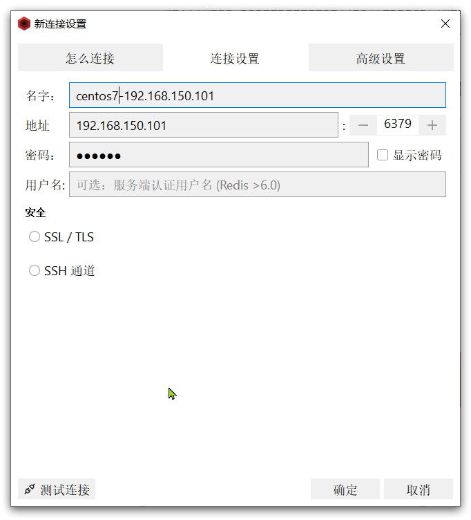
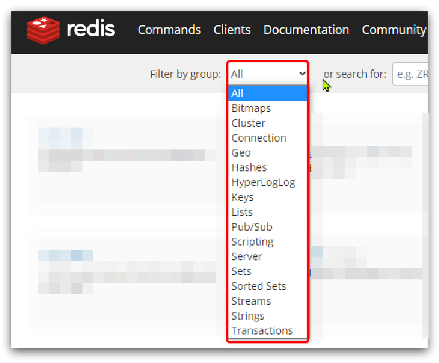

# 基础篇Redis
 - [官网查命令](https://www.redis.net.cn/order/)
 - [b站狂神说 redis](https://www.bilibili.com/video/BV1S54y1R7SB?p=1&vd_source=41cf0bf8fd5d0fd2788aa7ff7dd66abc)
 - [官网各种redis客户端](https://redis.io/docs/clients/)
 - [官网最新版配置文件地址/redis.conf/sentinel.conf](http://download.redis.io/redis-stable/)

# 目录
- [基础篇Redis](#基础篇redis)
- [目录](#目录)
  - [1.Redis简单介绍](#1redis简单介绍)
  - [2.初始Redis](#2初始redis)
    - [2.1.认识NoSQL](#21认识nosql)
      - [2.1.1.结构化与非结构化](#211结构化与非结构化)
      - [2.1.2.关联和非关联](#212关联和非关联)
      - [2.1.3.查询方式](#213查询方式)
      - [2.1.4.事务](#214事务)
      - [2.1.5.总结](#215总结)
    - [2.2.认识Redis](#22认识redis)
    - [2.3.安装Redis](#23安装redis)
      - [2.3.1.依赖库](#231依赖库)
      - [2.3.2.上传安装包并解压](#232上传安装包并解压)
      - [2.3.3.启动](#233启动)
      - [2.3.4.默认启动](#234默认启动)
      - [2.3.5.指定配置启动](#235指定配置启动)
      - [2.3.6.开机自启](#236开机自启)
      - [2.3.6.docker 启动redis](#236docker-启动redis)
    - [2.4.Redis桌面客户端](#24redis桌面客户端)
      - [2.4.1.Redis命令行客户端](#241redis命令行客户端)
      - [2.4.2.图形化桌面客户端](#242图形化桌面客户端)
      - [2.4.3.安装](#243安装)
      - [2.4.4.建立连接](#244建立连接)
  - [3.Redis常见命令](#3redis常见命令)
    - [3.1 Redis数据结构介绍](#31-redis数据结构介绍)
    - [3.2 Redis 通用命令](#32-redis-通用命令)
    - [3.3 Redis命令-String命令](#33-redis命令-string命令)
    - [3.4 Redis命令-Key的层级结构](#34-redis命令-key的层级结构)
    - [3.5 Redis命令-Hash命令](#35-redis命令-hash命令)
    - [3.6 Redis命令-List命令](#36-redis命令-list命令)
    - [3.7 Redis命令-Set命令](#37-redis命令-set命令)
    - [3.8 Redis命令-SortedSet类型](#38-redis命令-sortedset类型)
    - [3.9 Redis命令-Geospatil类型](#39-redis命令-geospatil类型)
    - [3.10 Redis命令-HyperLogLog类型](#310-redis命令-hyperloglog类型)
    - [3.11 Redis命令-Bitmap类型](#311-redis命令-bitmap类型)
  - [4.Redis的Java客户端-Jedis](#4redis的java客户端-jedis)
    - [4.1 Jedis快速入门](#41-jedis快速入门)
    - [4.2 Jedis连接池](#42-jedis连接池)
      - [4.2.1.创建Jedis的连接池](#421创建jedis的连接池)
      - [4.2.2.改造原始代码](#422改造原始代码)
  - [5.Redis的Java客户端-SpringDataRedis](#5redis的java客户端-springdataredis)
    - [5.1.快速入门](#51快速入门)
      - [5.1.1.导入pom坐标](#511导入pom坐标)
      - [5.1.2 .配置文件](#512-配置文件)
      - [5.1.3.测试代码](#513测试代码)
    - [5.2 .数据序列化器](#52-数据序列化器)
    - [5.3 StringRedisTemplate](#53-stringredistemplate)
    - [5.4 Hash结构操作](#54-hash结构操作)
  - [6.Redis事务](#6redis事务)
  - [7.redis.conf](#7redisconf)
  - [8.Redis 持久化](#8redis-持久化)
  - [9.Redis 订阅](#9redis-订阅)
  - [10.Redis 主从复制](#10redis-主从复制)
  - [11.Redis 哨兵模式](#11redis-哨兵模式)
  - [12.Redis 缓存穿透与雪崩](#12redis-缓存穿透与雪崩)

## 1.Redis简单介绍
Redis是一个开源的，内存中的数据结构存储系统，它可以用作==数据库==、==缓存==和==消息中间件==MQ。它支持多种类型的数据结构，如字符串（string），散列（hash），列表（lists），集合（sets），有序集合（sorted sets）与范围查询，bitmaps，hyperloglogs和地理空间（geospatial）索引半径查询。Redis内置了复制（replication）,LUA脚本，LRU驱动事件，事务和不同级别的磁盘持久化，并通过Redis哨兵（Sentinel）和自动分区（Cluster）提高高可用性。 

Redis是一种键值型的NoSql数据库，这里有两个关键字：

- 键值型
- NoSql

其中**键值型**，是指Redis中存储的数据都是以key.value对的形式存储，而value的形式多种多样，可以是字符串.数值.甚至json：


而NoSql则是相对于传统关系型数据库而言，有很大差异的一种数据库。

对于存储的数据，没有类似Mysql那么严格的约束，比如唯一性，是否可以为null等等，所以我们把这种松散结构的数据库，称之为NoSQL数据库。

## 2.初始Redis

### 2.1.认识NoSQL

**NoSql**可以翻译做Not Only Sql（不仅仅是SQL），或者是No Sql（非Sql的）数据库。是相对于传统关系型数据库而言，有很大差异的一种特殊的数据库，因此也称之为**非关系型数据库**。

#### 2.1.1.结构化与非结构化

传统关系型数据库是结构化数据，每一张表都有严格的约束信息：字段名.字段数据类型.字段约束等等信息，插入的数据必须遵守这些约束：


而NoSql则对数据库格式没有严格约束，往往形式松散，自由。
可以是键值型


也可以是文档型(==mongodb==)


甚至可以是图格式


#### 2.1.2.关联和非关联

传统数据库的表与表之间往往存在关联，例如==外键==


而非关系型数据库不存在关联关系，要维护关系要么靠代码中的业务逻辑，要么靠数据之间的耦合：

```json
{
  id: 1,
  name: "张三",
  orders: [
    {
       id: 1,
       item: {
	 id: 10, title: "荣耀6", price: 4999
       }
    },
    {
       id: 2,
       item: {
	 id: 20, title: "小米11", price: 3999
       }
    }
  ]
}
```

此处要维护“张三”的订单与商品“荣耀”和“小米11”的关系，不得不冗余的将这两个商品保存在张三的订单文档中，不够优雅。还是建议用业务来维护关联关系。


#### 2.1.3.查询方式

传统关系型数据库会基于Sql语句做查询，语法有统一标准；

而不同的非关系数据库查询语法差异极大，五花八门各种各样。


#### 2.1.4.事务

传统关系型数据库能满足事务ACID的原则。


而非关系型数据库往往不支持事务，或者不能严格保证ACID的特性，只能实现基本的一致性。


#### 2.1.5.总结

除了上述四点以外，在存储方式.扩展性.查询性能上关系型与非关系型也都有着显著差异，总结如下：


- 存储方式
  - 关系型数据库基于磁盘进行存储，会有大量的磁盘IO，对性能有一定影响
  - 非关系型数据库，他们的操作更多的是依赖于内存来操作，内存的读写速度会非常快，性能自然会好一些

* 扩展性
  * 关系型数据库集群模式一般是主从，主从数据一致，起到数据备份的作用，称为垂直扩展。
  * 非关系型数据库可以将数据拆分，存储在不同机器上，可以保存海量数据，解决内存大小有限的问题。称为水平扩展。
  * 关系型数据库因为表之间存在关联关系，如果做水平扩展会给数据查询带来很多麻烦

### 2.2.认识Redis

Redis诞生于2009年全称是**Re**mote  **D**ictionary **S**erver 远程词典服务器，是一个基于内存的键值型NoSQL数据库。

**特征**：

- 键值（key-value）型，value支持多种不同数据结构，功能丰富
- 单线程，每个命令具备原子性
- 低延迟，速度快（基于内存.IO多路复用.良好的编码）。
- 支持数据持久化
- 支持主从集群.分片集群
- 支持多语言客户端

**作者**：Antirez

Redis的官方网站地址：https://redis.io/

### 2.3.安装Redis

大多数企业都是基于Linux服务器来部署项目，而且Redis官方也没有提供Windows版本的安装包。因此课程中我们会基于Linux系统来安装Redis.

此处选择的Linux版本为CentOS 7.

#### 2.3.1.依赖库

Redis是基于C语言编写的，因此首先需要安装Redis所需要的gcc依赖：

```bash
sudo apt install -y gcc tcl
```

#### 2.3.2.上传安装包并解压

将Redis安装包上传到虚拟机的任意目录：

解压缩：

```sh
tar -xzf redis-6.2.6.tar.gz
```

解压后进入redis目录


运行编译命令：

```sh
make && make install
```

安装成功

默认的安装路径是在 `/usr/local/bin`目录下：

该目录已经默认配置到环境变量，因此可以在任意目录下运行这些命令。其中：

- redis-cli：是redis提供的命令行客户端
- redis-server：是redis的服务端启动脚本
- redis-sentinel：是redis的哨兵启动脚本
- redis-benchmark：是redis的性能测试脚本
#### 2.3.3.启动

redis的启动方式有很多种，例如：

- 默认启动
- 指定配置启动
- 开机自启

#### 2.3.4.默认启动

安装完成后，在任意目录输入redis-server命令即可启动Redis：

```
redis-server
```


这种启动属于`前台启动`，会阻塞整个会话窗口，窗口关闭或者按下`CTRL + C`则Redis停止。不推荐使用。

#### 2.3.5.指定配置启动

如果要让Redis以`后台`方式启动，则必须修改Redis配置文件，就在我们之前解压的redis安装包下（`/usr/local/src/redis-6.2.6`），名字叫redis.conf：


我们先将这个配置文件备份一份：

```bash
cp redis.conf redis.conf.bck
```

然后修改redis.conf文件中的一些配置：

```properties
# 允许访问的地址，默认是127.0.0.1，会导致只能在本地访问。修改为0.0.0.0则可以在任意IP访问，生产环境不要设置为0.0.0.0
bind 0.0.0.0
# 守护进程，修改为yes后即可后台运行
daemonize yes 
# 密码，设置后访问Redis必须输入密码
requirepass 123321
```

Redis的其它常见配置：

```properties
# 监听的端口
port 6379
# 工作目录，默认是当前目录，也就是运行redis-server时的命令，日志.持久化等文件会保存在这个目录
dir .
# 数据库数量，设置为1，代表只使用1个库，默认有16个库，编号0~15
databases 1
# 设置redis能够使用的最大内存
maxmemory 512mb
# 日志文件，默认为空，不记录日志，可以指定日志文件名
logfile "redis.log"
```

启动Redis：

```sh
# 进入redis安装目录 
cd /usr/local/src/redis-6.2.6
# 启动
redis-server redis.conf
```

停止服务：

```sh
# 利用redis-cli来执行 shutdown 命令，即可停止 Redis 服务，
# 因为之前配置了密码，因此需要通过 -u 来指定密码
redis-cli -u 123321 shutdown
```


#### 2.3.6.开机自启

我们也可以通过配置来实现开机自启。

首先，新建一个系统服务文件：

```sh
vi /etc/systemd/system/redis.service
```

内容如下：

```conf
[Unit]
Description=redis-server
After=network.target

[Service]
Type=forking
ExecStart=/usr/local/bin/redis-server /usr/local/src/redis-6.2.6/redis.conf
PrivateTmp=true

[Install]
WantedBy=multi-user.target
```


然后重载系统服务：

```sh
systemctl daemon-reload
```

下面这组命令来操作redis：

```sh
# 启动
systemctl start redis
# 停止
systemctl stop redis
# 重启
systemctl restart redis
# 查看状态
systemctl status redis
```

执行下面的命令，可以让redis开机自启：

```sh
systemctl enable redis
```
#### 2.3.6.docker 启动redis
redis c++客户端安装：
```bash
    # 安装 hiredis
    git clone https://github.com/redis/hiredis.git

    cd hiredis

    make

    make install

    # 安装 redis++
    git clone https://github.com/sewenew/redis-plus-plus.git

    cd redis-plus-plus

    mkdir build

    cd build

    cmake ..

    make

    make install

    cd ..

    测试
    ./build/test/test_redis++ -h host -p port -a auth
```
docker 下 redis 安装：
```properties
    # 修改redis.conf
    1. 开启redis验证 （可选）
        requirepass xxx

    2. 注释掉 bind 127.0.0.1 （*必做）
        # bind 127.0.0.1

    3. 将daemonize yes注释掉或改成 daemonize no ,该配置与docker run -d 冲突，会导致容器启动失败 （*必做）
        daemonize no

    4.redis数据持久化 （可选）
        appendonly yes
    
    # docker 启动redis
        sudo docker run -p 6379:6379 --name redis --privileged=true -v /app/redis/redis.conf:/etc/redis/redis.conf -v /app/redis/data:/data -d redis redis-server /etc/redis/redis.conf
    
    redis++ 编译时 需要链接 lhiredis lredis++ pthread 库
```

### 2.4.Redis桌面客户端

安装完成Redis，我们就可以操作Redis，实现数据的CRUD了。这需要用到Redis客户端，包括：

- 命令行客户端
- 图形化桌面客户端
- 编程客户端

#### 2.4.1.Redis命令行客户端

Redis安装完成后就自带了命令行客户端：redis-cli，使用方式如下：

```sh
redis-cli [options] [commonds]
```

其中常见的options有：

- `-h 127.0.0.1`：指定要连接的redis节点的IP地址，默认是127.0.0.1
- `-p 6379`：指定要连接的redis节点的端口，默认是6379
- `-a 123321`：指定redis的访问密码 

其中的commonds就是Redis的操作命令，例如：

- `ping`：与redis服务端做心跳测试，服务端正常会返回`pong`

不指定commond时，会进入`redis-cli`的交互控制台：


#### 2.4.2.图形化桌面客户端

GitHub上的大神编写了Redis的图形化桌面客户端，地址：https://github.com/uglide/RedisDesktopManager

不过该仓库提供的是RedisDesktopManager的源码，并未提供windows安装包。


在下面这个仓库可以找到安装包：https://github.com/lework/RedisDesktopManager-Windows/releases


#### 2.4.3.安装

官网下载Redis的图形化桌面客户端；

解压缩后，运行安装程序即可安装；


安装完成后，在安装目录下找到rdm.exe文件；


双击即可运行。


#### 2.4.4.建立连接

点击左上角的`连接到Redis服务器`按钮；


在弹出的窗口中填写Redis服务信息；


点击确定后，在左侧菜单会出现这个链接；


点击即可建立连接了。


Redis默认有16个仓库，编号从0至15.  通过配置文件可以设置仓库数量，但是不超过16，并且不能自定义仓库名称。

如果是基于redis-cli连接Redis服务，可以通过select命令来选择数据库：

```sh
# 选择 0号库
select 0
```

## 3.Redis常见命令

### 3.1 Redis数据结构介绍

Redis是一个key-value的数据库，key一般是String类型，不过value的类型多种多样：


**Note：命令不要死记，学会查询就好**

Redis为了方便我们学习，将操作不同数据类型的命令也做了分组，在官网（ https://redis.io/commands ）可以查看到不同的命令：



当然我们也可以通过Help命令来帮助我们去查看命令


### 3.2 Redis 通用命令

通用指令是部分数据类型的，都可以使用的指令，常见的有：

- KEYS：查看符合模板的所有key
- DEL：删除一个指定的key
- EXISTS：判断key是否存在
- EXPIRE：给一个key设置有效期，有效期到期时该key会被自动删除
- TTL：查看一个KEY的剩余有效期
- TYPE： 查看一个KEY的类型
- FLUSHDB：清空当前数据库，不执行持久化操作
- FLUSHALL：清空所有数据库并执行持久化操作
- MOVE：移动到另一个数据库
- APPEND：在对应key的val后增加信息
通过help [command] 可以查看一个命令的具体用法，例如：


* KEYS

```sh
127.0.0.1:6379> keys *
1) "name"
2) "age"
127.0.0.1:6379>

# 查询以a开头的key
127.0.0.1:6379> keys a*
1) "age"
127.0.0.1:6379>
```

**Note：在生产环境下，不推荐使用keys 命令，因为这个命令在key过多的情况下，效率不高**

* DEL

```bash
127.0.0.1:6379> help del

  DEL key [key ...]
  summary: Delete a key
  since: 1.0.0
  group: generic

127.0.0.1:6379> del name #删除单个
(integer) 1  #成功删除1个

127.0.0.1:6379> keys *
1) "age"

127.0.0.1:6379> MSET k1 v1 k2 v2 k3 v3 #批量添加数据
OK

127.0.0.1:6379> keys *
1) "k3"
2) "k2"
3) "k1"
4) "age"

127.0.0.1:6379> del k1 k2 k3 k4
(integer) 3   #此处返回的是成功删除的key，由于redis中只有k1,k2,k3 所以只成功删除3个，最终返回
127.0.0.1:6379>

127.0.0.1:6379> keys * #再查询全部的key
1) "age"	#只剩下一个了
127.0.0.1:6379>
```

**Note：拷贝代码的时候，只需要拷贝对应的命令**

* EXISTS

```sh
127.0.0.1:6379> help EXISTS

  EXISTS key [key ...]
  summary: Determine if a key exists
  since: 1.0.0
  group: generic

127.0.0.1:6379> exists age
(integer) 1

127.0.0.1:6379> exists name
(integer) 0
```

* EXPIRE

**Note**：内存非常宝贵，对于一些数据，我们应当给他一些过期时间，当过期时间到了之后，他就会自动被删除

```sh
127.0.0.1:6379> expire age 10
(integer) 1

127.0.0.1:6379> ttl age
(integer) 8

127.0.0.1:6379> ttl age
(integer) 6

127.0.0.1:6379> ttl age
(integer) -2

127.0.0.1:6379> ttl age
(integer) -2  #当这个key过期了，那么此时查询出来就是-2 

127.0.0.1:6379> keys *
(empty list or set)

127.0.0.1:6379> set age 10 #如果没有设置过期时间
OK

127.0.0.1:6379> ttl age
(integer) -1  # ttl的返回值就是-1
```


### 3.3 Redis命令-String命令

String类型，也就是字符串类型，是Redis中最简单的存储类型。

其value是字符串，不过根据字符串的格式不同，又可以分为3类：

* string：普通字符串
* int：整数类型，可以做自增.自减操作
* float：浮点类型，可以做自增.自减操作


String的常见命令有：

* SET：添加或者修改已经存在的一个String类型的键值对
* SETRANGE：替换修改
* SETNX：添加一个String类型的键值对，前提是这个key不存在，否则不执行
* SETEX：添加一个String类型的键值对，并且指定有效期
* MSET：批量添加多个String类型的键值对
* MSETNX：批量添加多个String类型的键值对，原子性，要么同时成功，要么同时失败
* GET：根据key获取String类型的value
* GETRANG：获取字符串子串 
* MGET：根据多个key获取多个String类型的value
* GETSET：先获取再设置
* INCR：让一个整型的key自增1
* DECR：让一个整型的key自减1
* INCRBY:让一个整型的key自增并指定步长，例如：incrby num 2 让num值自增2
* INCRBYFLOAT：让一个浮点类型的数字自增并指定步长
* STRLEN：返回字符串长度
* APPEND：在对应key的val后增加字符串 （如果key不存在，及创建key）
**Note**：以上命令除了INCRBYFLOAT 都是常用命令, SET 和GET: 如果key不存在则是新增，如果存在则是修改

>设置key时可以使用 : 分级， usr:1:name {usr}:{id}:{field}

```java
127.0.0.1:6379> set name Rose  //原来不存在
OK

127.0.0.1:6379> get name 
"Rose"

127.0.0.1:6379> set name Jack //原来存在，就是修改
OK

127.0.0.1:6379> get name
"Jack"
```

* MSET和MGET

```java
127.0.0.1:6379> MSET k1 v1 k2 v2 k3 v3
OK

127.0.0.1:6379> MGET name age k1 k2 k3
1) "Jack" //之前存在的name
2) "10"   //之前存在的age
3) "v1"
4) "v2"
5) "v3"
```

* INCR和INCRBY和DECY

```java
127.0.0.1:6379> get age 
"10"

127.0.0.1:6379> incr age //增加1
(integer) 11
    
127.0.0.1:6379> get age //获得age
"11"

127.0.0.1:6379> incrby age 2 //一次增加2
(integer) 13 //返回目前的age的值
    
127.0.0.1:6379> incrby age 2
(integer) 15
    
127.0.0.1:6379> incrby age -1 //也可以增加负数，相当于减
(integer) 14
    
127.0.0.1:6379> incrby age -2 //一次减少2个
(integer) 12
    
127.0.0.1:6379> DECR age //相当于 incr 负数，减少正常用法
(integer) 11
    
127.0.0.1:6379> get age 
"11"

```

* SETNX

```java
127.0.0.1:6379> help setnx

  SETNX key value
  summary: Set the value of a key, only if the key does not exist
  since: 1.0.0
  group: string

127.0.0.1:6379> set name Jack  //设置名称
OK
127.0.0.1:6379> setnx name lisi //如果key不存在，则添加成功
(integer) 0
127.0.0.1:6379> get name //由于name已经存在，所以lisi的操作失败
"Jack"
127.0.0.1:6379> setnx name2 lisi //name2 不存在，所以操作成功
(integer) 1
127.0.0.1:6379> get name2 
"lisi"
```

* SETEX

```sh
127.0.0.1:6379> setex name 10 jack
OK

127.0.0.1:6379> ttl name
(integer) 8

127.0.0.1:6379> ttl name
(integer) 7

127.0.0.1:6379> ttl name
(integer) 5
```


### 3.4 Redis命令-Key的层级结构

Redis没有类似MySQL中的Table的概念，我们该如何区分不同类型的key呢？

例如，需要存储用户.商品信息到redis，有一个用户id是1，有一个商品id恰好也是1，此时如果使用id作为key，那就会冲突了，该怎么办？

我们可以通过给key添加前缀加以区分，不过这个前缀不是随便加的，有一定的规范：

Redis的key允许有多个单词形成层级结构，多个单词之间用':'隔开，格式如下：


这个格式并非固定，也可以根据自己的需求来删除或添加词条。

例如我们的项目名称叫 heima，有user和product两种不同类型的数据，我们可以这样定义key：

- user相关的key：**heima:user:1**

- product相关的key：**heima:product:1**

如果Value是一个Java对象，例如一个User对象，则可以将对象序列化为JSON字符串后存储：

| **KEY**         | **VALUE**                                 |
| --------------- | ----------------------------------------- |
| heima:user:1    | {"id":1, "name": "Jack", "age": 21}       |
| heima:product:1 | {"id":1, "name": "小米11", "price": 4999} |

一旦我们向redis采用这样的方式存储，那么在可视化界面中，redis会以层级结构来进行存储，形成类似于这样的结构，更加方便Redis获取数据


### 3.5 Redis命令-Hash命令

Hash类型，也叫散列，其value是一个无序字典，类似于Java中的HashMap结构。

String结构是将对象序列化为JSON字符串后存储，当需要修改对象某个字段时很不方便：


Hash结构可以将对象中的每个字段独立存储，可以针对单个字段做CRUD：


Hash 适合存储==对象==类型.

**Hash类型的常见命令**

- HSET key field value：添加或者修改hash类型key的field的值
- HMSET：批量添加多个hash类型key的field的值 
- HGET key field：获取一个hash类型key的field的值
- HMGET：批量获取多个hash类型key的field的值
- HGETALL：获取一个hash类型的key中的所有的field和value
- HKEYS：获取一个hash类型的key中的所有的field
- HINCRBY:让一个hash类型key的字段值自增并指定步长
- HSETNX：添加一个hash类型的key的field值，前提是这个field不存在，否则不执行
- HDEL：删除指定的key及其val
- HLEN：返回hash字段数量
- HEXISTS：判断指定key是否存在

**Note**：哈希结构也是我们以后实际开发中常用的命令哟

* HSET和HGET

```java
127.0.0.1:6379> HSET heima:user:3 name Lucy//大key是 heima:user:3 小key是name，小value是Lucy
(integer) 1
127.0.0.1:6379> HSET heima:user:3 age 21// 如果操作不存在的数据，则是新增
(integer) 1
127.0.0.1:6379> HSET heima:user:3 age 17 //如果操作存在的数据，则是修改
(integer) 0
127.0.0.1:6379> HGET heima:user:3 name 
"Lucy"
127.0.0.1:6379> HGET heima:user:3 age
"17"
```

* HMSET和HMGET

```java
127.0.0.1:6379> HMSET heima:user:4 name HanMeiMei
OK
127.0.0.1:6379> HMSET heima:user:4 name LiLei age 20 sex man
OK
127.0.0.1:6379> HMGET heima:user:4 name age sex
1) "LiLei"
2) "20"
3) "man"
```

* HGETALL

```java
127.0.0.1:6379> HGETALL heima:user:4
1) "name"
2) "LiLei"
3) "age"
4) "20"
5) "sex"
6) "man"
```

* HKEYS和HVALS

```java
127.0.0.1:6379> HKEYS heima:user:4
1) "name"
2) "age"
3) "sex"
127.0.0.1:6379> HVALS heima:user:4
1) "LiLei"
2) "20"
3) "man"
```

* HINCRBY

```java
127.0.0.1:6379> HINCRBY  heima:user:4 age 2
(integer) 22
127.0.0.1:6379> HVALS heima:user:4
1) "LiLei"
2) "22"
3) "man"
127.0.0.1:6379> HINCRBY  heima:user:4 age -2
(integer) 20
```

* HSETNX

```java
127.0.0.1:6379> HSETNX heima:user4 sex woman
(integer) 1
127.0.0.1:6379> HGETALL heima:user:3
1) "name"
2) "Lucy"
3) "age"
4) "17"
127.0.0.1:6379> HSETNX heima:user:3 sex woman
(integer) 1
127.0.0.1:6379> HGETALL heima:user:3
1) "name"
2) "Lucy"
3) "age"
4) "17"
5) "sex"
6) "woman"
```

### 3.6 Redis命令-List命令

Redis中的List类型与Java中的LinkedList类似，可以看做是一个双向链表结构。既可以支持正向检索和也可以支持反向检索。

特征也与LinkedList类似：

* 有序
* 元素可以重复
* 插入和删除快
* 查询速度一般

常用来存储一个有序数据，例如：朋友圈点赞列表，评论列表等。

**List的常见命令有：**

- LPUSH key element ... ：向列表左侧插入一个或多个元素
- RPUSH key element ... ：向列表右侧插入一个或多个元素
- LPOP key：移除并返回列表左侧的第一个元素，没有则返回nil
- RPOP key：移除并返回列表右侧的第一个元素
- LRANGE key star end：返回一段角标范围内的所有元素
- BLPOP和BRPOP：与LPOP和RPOP类似，只不过在没有元素时等待指定时间，而不是直接返回nil
- LINDEX：通过下标获得list中的某个值
- LLEN：获取list长度
- LREM：移除list指定值
- LTRIM：截取list中指定范围的元素
- RPOPLPUSH: 移除列表的最后一个元素，并将它保存到另一个列表中
- LSET：将列表中指定下标的值替换为另一个值
- LINSERT：


* LPUSH和RPUSH

```java
127.0.0.1:6379> LPUSH users 1 2 3
(integer) 3
127.0.0.1:6379> RPUSH users 4 5 6
(integer) 6
```

* LPOP和RPOP

```java
127.0.0.1:6379> LPOP users
"3"
127.0.0.1:6379> RPOP users
"6"
```

* LRANGE

```java
127.0.0.1:6379> LRANGE users 1 2
1) "1"
2) "4"
```

* LINSERT
`LINSERT LINSERT key BEFORE|AFTER pivot element`

```java
127.0.0.1:6379> LINSERT list after word my
(integer) 3
127.0.0.1:6379> LRANGE list 0 -1
1) "word"
2) "my"
3) "hello"
```
### 3.7 Redis命令-Set命令

Redis的Set结构与Java中的HashSet类似，可以看做是一个value为null的HashMap。因为也是一个hash表，因此具备与HashSet类似的特征：

* 无序
* 元素不可重复
* 查找快
* 支持交集.并集.差集等功能

例如，社交软件的共同关注（并集）
**Set类型的常见命令**

* SADD key member ... ：向set中添加一个或多个元素
* SREM key member ... : 移除set中的指定元素
* SCARD key： 返回set中元素的个数
* SISMEMBER key member：判断一个元素是否存在于set中
* SMEMBERS：获取set中的所有元素
* SINTER key1 key2 ... ：求key1与key2的交集
* SDIFF key1 key2 ... ：求key1与key2的差集
* SUNION key1 key2 ..：求key1和key2的并集
* SPOP key count：随机移除指定数量元素
* SMOVE source destination member：将指定元素从当前set移动到另一个set


例如两个集合：s1和s2:


求交集：SINTER s1 s2

求s1与s2的不同：SDIFF s1 s2


**具体命令**

```java
127.0.0.1:6379> sadd s1 a b c
(integer) 3
127.0.0.1:6379> smembers s1
1) "c"
2) "b"
3) "a"
127.0.0.1:6379> srem s1 a
(integer) 1
    
127.0.0.1:6379> SISMEMBER s1 a
(integer) 0
    
127.0.0.1:6379> SISMEMBER s1 b
(integer) 1
    
127.0.0.1:6379> SCARD s1
(integer) 2

127.0.0.1:6379> SPOP set 2
1) "3"
2) "5"
127.0.0.1:6379>

```

**案例**

* 将下列数据用Redis的Set集合来存储：
* 张三的好友有：李四.王五.赵六
* 李四的好友有：王五.麻子.二狗
* 利用Set的命令实现下列功能：
* 计算张三的好友有几人
* 计算张三和李四有哪些共同好友
* 查询哪些人是张三的好友却不是李四的好友
* 查询张三和李四的好友总共有哪些人
* 判断李四是否是张三的好友
* 判断张三是否是李四的好友
* 将李四从张三的好友列表中移除

```java
127.0.0.1:6379> SADD zs lisi wangwu zhaoliu
(integer) 3
    
127.0.0.1:6379> SADD ls wangwu mazi ergou
(integer) 3
    
127.0.0.1:6379> SCARD zs
(integer) 3
    
127.0.0.1:6379> SINTER zs ls
1) "wangwu"
    
127.0.0.1:6379> SDIFF zs ls
1) "zhaoliu"
2) "lisi"
    
127.0.0.1:6379> SUNION zs ls
1) "wangwu"
2) "zhaoliu"
3) "lisi"
4) "mazi"
5) "ergou"
    
127.0.0.1:6379> SISMEMBER zs lisi
(integer) 1
    
127.0.0.1:6379> SISMEMBER ls zhangsan
(integer) 0
    
127.0.0.1:6379> SREM zs lisi
(integer) 1
    
127.0.0.1:6379> SMEMBERS zs
1) "zhaoliu"
2) "wangwu"
```

### 3.8 Redis命令-SortedSet类型

Redis的SortedSet是一个可排序的set集合，与Java中的TreeSet有些类似，但底层数据结构却差别很大。SortedSet中的每一个元素都带有一个score属性，可以基于score属性对元素排序，底层的实现是一个跳表（SkipList）加 hash表。

SortedSet具备下列特性：

- 可排序
- 元素不重复
- 查询速度快

因为SortedSet的可排序特性，经常被用来实现排行榜这样的功能。


SortedSet的常见命令有：

- ZADD key score member：添加一个或多个元素到sorted set ，如果已经存在则更新其score值
- ZREM key member：删除sorted set中的一个指定元素
- ZSCORE key member : 获取sorted set中的指定元素的score值
- ZRANK key member：获取sorted set 中的指定元素的排名
- ZCARD key：获取sorted set中的元素个数
- ZCOUNT key min max：统计score值在给定范围内的所有元素的个数
- ZINCRBY key increment member：让sorted set中的指定元素自增，步长为指定的increment值
- ZRANGE key min max：按照score排序后，获取指定排名范围内的元素
- ZRANGEBYSCORE key min max：按照score排序后，获取指定score范围内的元素 -inf +inf
- ZREVRANGEBYSCORE：相反操作
- ZDIFF.ZINTER.ZUNION：求差集.交集.并集

注意：所有的排名默认都是升序，如果要降序则在命令的Z后面添加REV即可，例如：

- **升序**获取sorted set 中的指定元素的排名：ZRANK key member
- **降序**获取sorted set 中的指定元素的排名：ZREVRANK key memeber

### 3.9 Redis命令-Geospatil类型
推算地理位置信息，两地之间的距离，方圆几里的人
- [官方文档](https://www.redis.net.cn/order/3685.html)

**Note**
```bash 
GEOADD
两极无法直接添加，一般会下载城市数据，通过客户端程序添加数据
有效的经度从-180度到180度。
有效的纬度从-85.05112878度到85.05112878度。
当坐标位置超出上述指定范围时，该命令将会返回一个错误。

GEODIST
如果两个位置之间的其中一个不存在， 那么命令返回空值。
指定单位的参数 unit 必须是以下单位的其中一个：
m 表示单位为米。
km 表示单位为千米。
mi 表示单位为英里。
ft 表示单位为英尺。

```
Geospatil的常见命令有：

- GEOADD：将指定的地理空间位置（纬度、经度、名称）添加到指定的key中
- GEOPOS：从key里返回所有给定位置元素的位置（经度和纬度）
- GEODIST：返回两个给定位置之间的距离
- GEORADIUS：以给定的经纬度为中心， 找出某一半径内的元素
- GEORADIUSBYMEMBER：找出位于指定范围内的元素，中心点是由给定的位置元素决定，以成员为中心
- GEOHASH：返回一个或多个位置元素的 Geohash 表示，该命令将经纬度返回11个字符的Geohash字符串，字符串越相似，距离越近


> ***==GEO 的 实现原理其实就是 ZSET，可以用 ZSET 相关命令操作 GEO==***

获取附近的人的定位，通过半径来查


### 3.10 Redis命令-HyperLogLog类型
Redis 2.8.9 版本就更新了Hyperloglog数据结构!
Redis Hyperloglog基数统计的算法!
优点︰占用的内存是固定，2^64不同的元素的基数，只需要废12KB内存!
==**0.81%的错误率**==
- Pfadd：添加指定元素到 HyperLogLog 中
- Pfcount：返回给定 HyperLogLog 的基数估算值
- Pgmerge：将多个 HyperLogLog 合并为一个 HyperLogLog

### 3.11 Redis命令-Bitmap类型
统计用户信息，两个状态的，都可以使用Bitmap
Bitmaps位图，只有两个状态，用二进制位 0 1 保存 


- SETBIT
- GETBIT
- BITCOUNT
## 4.Redis的Java客户端-Jedis

在Redis官网中提供了各种语言的客户端，地址：https://redis.io/docs/clients/


其中Java客户端也包含很多：


标记为❤的就是推荐使用的java客户端，包括：

- Jedis和Lettuce：这两个主要是提供了Redis命令对应的API，方便我们操作Redis，而SpringDataRedis又对这两种做了抽象和封装，因此我们后期会直接以SpringDataRedis来学习。
- Redisson：是在Redis基础上实现了分布式的可伸缩的java数据结构，例如Map.Queue等，而且支持跨进程的同步机制：Lock.Semaphore等待，比较适合用来实现特殊的功能需求。


### 4.1 Jedis快速入门

**入门案例详细步骤**

案例分析：

0）创建工程：


1）引入依赖：

```xml
<!--jedis-->
<dependency>
    <groupId>redis.clients</groupId>
    <artifactId>jedis</artifactId>
    <version>3.7.0</version>
</dependency>
<!--单元测试-->
<dependency>
    <groupId>org.junit.jupiter</groupId>
    <artifactId>junit-jupiter</artifactId>
    <version>5.7.0</version>
    <scope>test</scope>
</dependency>
```


2）建立连接

新建一个单元测试类，内容如下：

```java
private Jedis jedis;

@BeforeEach
void setUp() {
    // 1.建立连接
    // jedis = new Jedis("192.168.150.101", 6379);
    jedis = JedisConnectionFactory.getJedis();
    // 2.设置密码
    jedis.auth("123321");
    // 3.选择库
    jedis.select(0);
}
```


3）测试：

```java
@Test
void testString() {
    // 存入数据
    String result = jedis.set("name", "虎哥");
    System.out.println("result = " + result);
    // 获取数据
    String name = jedis.get("name");
    System.out.println("name = " + name);
}

@Test
void testHash() {
    // 插入hash数据
    jedis.hset("user:1", "name", "Jack");
    jedis.hset("user:1", "age", "21");

    // 获取
    Map<String, String> map = jedis.hgetAll("user:1");
    System.out.println(map);
}
```


4）释放资源

```java
@AfterEach
void tearDown() {
    if (jedis != null) {
        jedis.close();
    }
}
```


### 4.2 Jedis连接池

Jedis本身是线程不安全的，并且频繁的创建和销毁连接会有性能损耗，因此我们推荐大家使用Jedis连接池代替Jedis的直连方式

有关池化思想，并不仅仅是这里会使用，很多地方都有，比如说我们的数据库连接池，比如我们tomcat中的线程池，这些都是池化思想的体现。


#### 4.2.1.创建Jedis的连接池

- 

```java
public class JedisConnectionFacotry {

     private static final JedisPool jedisPool;

     static {
         //配置连接池
         JedisPoolConfig poolConfig = new JedisPoolConfig();
         poolConfig.setMaxTotal(8);
         poolConfig.setMaxIdle(8);
         poolConfig.setMinIdle(0);
         poolConfig.setMaxWaitMillis(1000);
         //创建连接池对象
         jedisPool = new JedisPool(poolConfig,
                 "192.168.150.101",6379,1000,"123321");
     }

     public static Jedis getJedis(){
          return jedisPool.getResource();
     }
}
```

**代码说明：**

- 1） JedisConnectionFacotry：工厂设计模式是实际开发中非常常用的一种设计模式，我们可以使用工厂，去降低代的耦合，比如Spring中的Bean的创建，就用到了工厂设计模式

- 2）静态代码块：随着类的加载而加载，确保只能执行一次，我们在加载当前工厂类的时候，就可以执行static的操作完成对 连接池的初始化

- 3）最后提供返回连接池中连接的方法.


#### 4.2.2.改造原始代码

**代码说明:**

1.在我们完成了使用工厂设计模式来完成代码的编写之后，我们在获得连接时，就可以通过工厂来获得。

，而不用直接去new对象，降低耦合，并且使用的还是连接池对象。

2.当我们使用了连接池后，当我们关闭连接其实并不是关闭，而是将Jedis还回连接池的。

```java
    @BeforeEach
    void setUp(){
        //建立连接
        /*jedis = new Jedis("127.0.0.1",6379);*/
        jedis = JedisConnectionFacotry.getJedis();
         //选择库
        jedis.select(0);
    }

   @AfterEach
    void tearDown() {
        if (jedis != null) {
            jedis.close();
        }
    }
```


## 5.Redis的Java客户端-SpringDataRedis

SpringData是Spring中数据操作的模块，包含对各种数据库的集成，其中对Redis的集成模块就叫做SpringDataRedis，官网地址：https://spring.io/projects/spring-data-redis

* 提供了对不同Redis客户端的整合（Lettuce和Jedis）
* 提供了RedisTemplate统一API来操作Redis
* 支持Redis的发布订阅模型
* 支持Redis哨兵和Redis集群
* 支持基于Lettuce的响应式编程
* 支持基于JDK.JSON.字符串.Spring对象的数据序列化及反序列化
* 支持基于Redis的JDKCollection实现

SpringDataRedis中提供了RedisTemplate工具类，其中封装了各种对Redis的操作。并且将不同数据类型的操作API封装到了不同的类型中：


### 5.1.快速入门

SpringBoot已经提供了对SpringDataRedis的支持，使用非常简单：

#### 5.1.1.导入pom坐标

```xml
<?xml version="1.0" encoding="UTF-8"?>
<project xmlns="http://maven.apache.org/POM/4.0.0" xmlns:xsi="http://www.w3.org/2001/XMLSchema-instance"
         xsi:schemaLocation="http://maven.apache.org/POM/4.0.0 https://maven.apache.org/xsd/maven-4.0.0.xsd">
    <modelVersion>4.0.0</modelVersion>
    <parent>
        <groupId>org.springframework.boot</groupId>
        <artifactId>spring-boot-starter-parent</artifactId>
        <version>2.5.7</version>
        <relativePath/> <!-- lookup parent from repository -->
    </parent>
    <groupId>com.heima</groupId>
    <artifactId>redis-demo</artifactId>
    <version>0.0.1-SNAPSHOT</version>
    <name>redis-demo</name>
    <description>Demo project for Spring Boot</description>
    <properties>
        <java.version>1.8</java.version>
    </properties>
    <dependencies>
        <!--redis依赖-->
        <dependency>
            <groupId>org.springframework.boot</groupId>
            <artifactId>spring-boot-starter-data-redis</artifactId>
        </dependency>
        <!--common-pool-->
        <dependency>
            <groupId>org.apache.commons</groupId>
            <artifactId>commons-pool2</artifactId>
        </dependency>
        <!--Jackson依赖-->
        <dependency>
            <groupId>com.fasterxml.jackson.core</groupId>
            <artifactId>jackson-databind</artifactId>
        </dependency>
        <dependency>
            <groupId>org.projectlombok</groupId>
            <artifactId>lombok</artifactId>
            <optional>true</optional>
        </dependency>
        <dependency>
            <groupId>org.springframework.boot</groupId>
            <artifactId>spring-boot-starter-test</artifactId>
            <scope>test</scope>
        </dependency>
    </dependencies>

    <build>
        <plugins>
            <plugin>
                <groupId>org.springframework.boot</groupId>
                <artifactId>spring-boot-maven-plugin</artifactId>
                <configuration>
                    <excludes>
                        <exclude>
                            <groupId>org.projectlombok</groupId>
                            <artifactId>lombok</artifactId>
                        </exclude>
                    </excludes>
                </configuration>
            </plugin>
        </plugins>
    </build>

</project>
```

#### 5.1.2 .配置文件

```yaml
spring:
  redis:
    host: 192.168.150.101
    port: 6379
    password: 123321
    lettuce:
      pool:
        max-active: 8  #最大连接
        max-idle: 8   #最大空闲连接
        min-idle: 0   #最小空闲连接
        max-wait: 100ms #连接等待时间
```

#### 5.1.3.测试代码

```java
@SpringBootTest
class RedisDemoApplicationTests {

    @Autowired
    private RedisTemplate<String, Object> redisTemplate;

    @Test
    void testString() {
        // 写入一条String数据
        redisTemplate.opsForValue().set("name", "虎哥");
        // 获取string数据
        Object name = redisTemplate.opsForValue().get("name");
        System.out.println("name = " + name);
    }
}
```

**贴心小提示：SpringDataJpa使用起来非常简单，记住如下几个步骤即可**

SpringDataRedis的使用步骤：

* 引入spring-boot-starter-data-redis依赖
* 在application.yml配置Redis信息
* 注入RedisTemplate


### 5.2 .数据序列化器

RedisTemplate可以接收任意Object作为值写入Redis：


只不过写入前会把Object序列化为字节形式，默认是采用JDK序列化，得到的结果是这样的：


缺点：

- 可读性差
- 内存占用较大


我们可以自定义RedisTemplate的序列化方式，代码如下：

```java
@Configuration
public class RedisConfig {

    @Bean
    public RedisTemplate<String, Object> redisTemplate(RedisConnectionFactory connectionFactory){
        // 创建RedisTemplate对象
        RedisTemplate<String, Object> template = new RedisTemplate<>();
        // 设置连接工厂
        template.setConnectionFactory(connectionFactory);
        // 创建JSON序列化工具
        GenericJackson2JsonRedisSerializer jsonRedisSerializer = 
            							new GenericJackson2JsonRedisSerializer();
        // 设置Key的序列化
        template.setKeySerializer(RedisSerializer.string());
        template.setHashKeySerializer(RedisSerializer.string());
        // 设置Value的序列化
        template.setValueSerializer(jsonRedisSerializer);
        template.setHashValueSerializer(jsonRedisSerializer);
        // 返回
        return template;
    }
}
```


这里采用了JSON序列化来代替默认的JDK序列化方式。最终结果如图：


整体可读性有了很大提升，并且能将Java对象自动的序列化为JSON字符串，并且查询时能自动把JSON反序列化为Java对象。不过，其中记录了序列化时对应的class名称，目的是为了查询时实现自动反序列化。这会带来额外的内存开销。


### 5.3 StringRedisTemplate

尽管JSON的序列化方式可以满足我们的需求，但依然存在一些问题，如图：


为了在反序列化时知道对象的类型，JSON序列化器会将类的class类型写入json结果中，存入Redis，会带来额外的内存开销。

为了减少内存的消耗，我们可以采用手动序列化的方式，换句话说，就是不借助默认的序列化器，而是我们自己来控制序列化的动作，同时，我们只采用String的序列化器，这样，在存储value时，我们就不需要在内存中就不用多存储数据，从而节约我们的内存空间


这种用法比较普遍，因此SpringDataRedis就提供了RedisTemplate的子类：StringRedisTemplate，它的key和value的序列化方式默认就是String方式。


省去了我们自定义RedisTemplate的序列化方式的步骤，而是直接使用：

```java
@SpringBootTest
class RedisStringTests {

    @Autowired
    private StringRedisTemplate stringRedisTemplate;

    @Test
    void testString() {
        // 写入一条String数据
        stringRedisTemplate.opsForValue().set("verify:phone:13600527634", "124143");
        // 获取string数据
        Object name = stringRedisTemplate.opsForValue().get("name");
        System.out.println("name = " + name);
    }

    private static final ObjectMapper mapper = new ObjectMapper();

    @Test
    void testSaveUser() throws JsonProcessingException {
        // 创建对象
        User user = new User("虎哥", 21);
        // 手动序列化
        String json = mapper.writeValueAsString(user);
        // 写入数据
        stringRedisTemplate.opsForValue().set("user:200", json);

        // 获取数据
        String jsonUser = stringRedisTemplate.opsForValue().get("user:200");
        // 手动反序列化
        User user1 = mapper.readValue(jsonUser, User.class);
        System.out.println("user1 = " + user1);
    }

}
```

此时我们再来看一看存储的数据，小伙伴们就会发现那个class数据已经不在了，节约了我们的空间~


最后小总结：

RedisTemplate的两种序列化实践方案：

* 方案一：
  * 自定义RedisTemplate
  * 修改RedisTemplate的序列化器为GenericJackson2JsonRedisSerializer

* 方案二：
  * 使用StringRedisTemplate
  * 写入Redis时，手动把对象序列化为JSON
  * 读取Redis时，手动把读取到的JSON反序列化为对象


### 5.4 Hash结构操作

在基础篇的最后，咱们对Hash结构操作一下，收一个小尾巴，这个代码咱们就不再解释啦

马上就开始新的篇章~~~进入到我们的Redis实战篇

```java
@SpringBootTest
class RedisStringTests {

    @Autowired
    private StringRedisTemplate stringRedisTemplate;


    @Test
    void testHash() {
        stringRedisTemplate.opsForHash().put("user:400", "name", "虎哥");
        stringRedisTemplate.opsForHash().put("user:400", "age", "21");

        Map<Object, Object> entries = stringRedisTemplate.opsForHash().entries("user:400");
        System.out.println("entries = " + entries);
    }
}
```

## 6.Redis事务
Redis事务的本质：一组命令的集合！一个事务中的所有命令会被序列化，执行过程中按顺序执行
一次性、顺序性、排他性

==Redis事务没有隔离级别的概念==
==Redis单条命令保证原子性，但事务不保证原子性==

- 开启事务(multi)
- 命令入队(...)
- 执行事务(exec)

>正常执行事务
```bash
127.0.0.1:6379> multi         # 开启事务
OK
# 命令入队
127.0.0.1:6379(TX)> set k1 v1
QUEUED
127.0.0.1:6379(TX)> set k2 v2
QUEUED
127.0.0.1:6379(TX)> get k1
QUEUED
127.0.0.1:6379(TX)> get k2
QUEUED
127.0.0.1:6379(TX)> exec # 执行事务
1) OK
2) OK
3) "v1"
4) "v2"
```
>放弃事务
```bash
127.0.0.1:6379> multi          # 开启事务
OK
127.0.0.1:6379(TX)> set k1 v1
QUEUED
127.0.0.1:6379(TX)> set k2 v2
QUEUED
127.0.0.1:6379(TX)> DISCARD    # 放弃事务
OK
127.0.0.1:6379> get k1  
(nil)                          # 事务中命令未执行
 
```

>编译型异常（代码有问题！命令有错！），事务中的所有命令都不会执行！
```bash
127.0.0.1:6379> multi
OK
127.0.0.1:6379(TX)> set k1 v1
QUEUED
127.0.0.1:6379(TX)> set k2 v2
QUEUED
127.0.0.1:6379(TX)> get k1 k2
(error) ERR wrong number of arguments for 'get' command    # 编译时出错
127.0.0.1:6379(TX)> set k3 v3
QUEUED
127.0.0.1:6379(TX)> exec
(error) EXECABORT Transaction discarded because of previous errors.
127.0.0.1:6379> get k1
(nil)                                                      # 所有命令均未执行
```
>运行时异常，错误命令抛出异常，其他命令正常执行。


可以看出Redis事务没有原子性
```bash
127.0.0.1:6379> multi
OK
127.0.0.1:6379(TX)> set k1 v1
QUEUED
127.0.0.1:6379(TX)> incr k1
QUEUED
127.0.0.1:6379(TX)> set k2 v2
QUEUED
127.0.0.1:6379(TX)> exec
1) OK
2) (error) ERR value is not an integer or out of range   # 只有错误命令未执行
3) OK
127.0.0.1:6379> get k2
"v2"

```

>监控

- WATCH
- UNWATCH

**悲观锁**
   - 很悲观，认为什么时候都会出问题，无论做什么都会加锁。


**乐观锁**  
   - 很乐观，认为什么时候都不会出问题，所以不会上锁，更新数据的时候判断在此期间是否有人修改过这个数据。

```bash
# 正常执行成功
127.0.0.1:6379> set money 100
OK
127.0.0.1:6379> set out 0
OK
127.0.0.1:6379> watch money           # 监视
OK
127.0.0.1:6379> multi
OK
127.0.0.1:6379(TX)> DECRBY money 20
QUEUED
127.0.0.1:6379(TX)> INCRBY out 20
QUEUED
127.0.0.1:6379(TX)> exec               # 事务正常结束，数据期间没有改变
1) (integer) 80
2) (integer) 20


# 两个客户端同时操作，使用watch当做redis的乐观锁
# cli-1
127.0.0.1:6379> get money
"80"
127.0.0.1:6379> set money 1000
OK
# cli-2
127.0.0.1:6379> watch money
OK
127.0.0.1:6379> multi
OK
127.0.0.1:6379(TX)> DECRBY money 10
QUEUED
127.0.0.1:6379(TX)> INCRBY out 10
QUEUED
127.0.0.1:6379(TX)> exec           # 事务开启后执行前，另外一个客户端修改了值，这个时候会导致失误执行失败

# 事务执行后会自动解锁
(nil)
```

## 7.redis.conf
```bash
1. 包含，可以将多个redis.conf合并
# include /path/to/local.conf
# include /path/to/other.conf
# include /path/to/fragments/*.conf

2. 网络
bind 127.0.0.1 -::1   # 绑定的ip
protected-mode no     # 保护模式
port 6379             # 端口号设置

3. 通用
daemonize no           # 以守护进程的方式运行，默认是no，使用docker时用no，否则会和docker run -d 冲突
/pidfile /var/run/redis_6379.pid # 以后台守护的方式运行，需要指定一个pid文件

# 日志
# Specify the server verbosity level.
# This can be one of:
# debug (a lot of information, useful for development/testing)
# verbose (many rarely useful info, but not a mess like the debug level)
# notice (moderately verbose, what you want in production probably)
# warning (only very important / critical messages are logged)
loglevel notice

logfile ""     # 日志的文件位置

databases 16    # 数据库数量，默认16个

always-show-logo no # 是否总是显示logo

4. 快照
持久化，在规定时间内，执行了多少次操作，则会持久化  .rdb .aof
redis是内存数据库，如果没有持久化，数据断电及失！

save 900 1  # 900s内，如果至少1个key被修改，进行持久化
save 300 10 # 300s内，如果至少10个key被修改，进行持久化
save 60 10000 # 60s内，如果至少10000个key被修改，进行持久化

stop-writes-on-bgsave-error yes   # 持久化出错，是否还要继续工作

rdbcompression yes  # 是否压缩 rbd 文件，需要消耗一些cpu资源

rdbchecksum yes    # 保存 rdb 文件时，进行错误的检查校验

dir ./       # 持久化生成的目录，默认在当前目录下

5. 复制
主库修改log文件名和rdb文件名即可
从库修改 端口号 pid文件名 log文件名 rdb文件名
repliction host port  # 主机ip 端口
masterauth            # 主机密码

6. 安全
requirepass foobared     # 设置密码
也可以在命令行设置：
127.0.0.1:6379> config set requirepass root  # 设置密码
OK
127.0.0.1:6379> auth root    # 登陆认证
OK
127.0.0.1:6379> config get requirepass    # 获取redis密码
1) "requirepass"
2) "root"

7. 客户端
maxclients 10000  # 限制最多有10000个客户端连接

8. 内存
maxmemory <bytes>   # redis最大内存容量

maxmemory-policy noeviction   # 内存满了的处理策略
    1. volatile-lru:从已设置过期时间的内存数据集中挑选最近最少使用的数据 淘汰；
    2. volatile-ttl: 从已设置过期时间的内存数据集中挑选即将过期的数据 淘汰；
    3. volatile-random:从已设置过期时间的内存数据集中任意挑选数据 淘汰；
    4. allkeys-lru:从内存数据集中挑选最近最少使用的数据 淘汰；
    5. allkeys-random:从数据集中任意挑选数据 淘汰；
    6. no-enviction(驱逐)：禁止驱逐数据。（默认淘汰策略。当redis内存数据达到maxmemory，在该策略下，直接返回OOM错误）；
9. APPEND ONLY 模式 aod配置
appendonly no   # 默认不开启 aof 模式，使用 rdb 模式，大部分情况 rdb 够用

appendfilename "appendonly.aof"   # 持久化文件的名字


# appendfsync always       # 每次修改都会 sync，消耗性能
appendfsync everysec       # 每秒执行一次 sync，可能会丢失数据
# appendfsync no           # 不执行 snyc，这个时候操作系统自己同步数据，速度最快 
```
## 8.Redis 持久化
1. RDB持久化
    RDB (==R==edis ==D==ata==B==ase)

    > 生成rdb文件

    在 redis.conf中配置rdb持久化规则。满足条件会保存一个dump.rdb文件
    几种触发持久化的方式。
    - save 的规则满足的情况下，会自动触发rdb规则
    - 执行 `flushall` 命令，也会触发rdb规则
    - 退出redis，也会生成rdb文件

    > 恢复 rdb 文件
    - 只需要将 rdb 文件放在 redis 启动目录下，redis 启动时会自动检查 dump.rdb 并恢复其中的数据。
    - 查看需要存在的位置
        ```bash
        127.0.0.1:6379> config get dir
        1) "dir"
        2) "/data"   # 如果这个目录存在 dump.rdb 文件，就会自动加载恢复其中的数据
        ```
    **优点**
        适合大规模的数据恢复！
        对数据完整性不高！
    **缺点**
        需要一定耳朵时间间隔进行操作，如果redis意外宕机，最后一次修改的数据就没有了。
        fork进程的时候，需要一定的内存空间，rdb是单独开了一个子进程fork父进程的数据。 

3. AOF持久化
    AOF(==A==ppend ==O==nly==F==ile)
    将我们的所有命令都记录下来，history，恢复的时候就把文件里的所有内容执行一遍。
    aof 保存 `appendonly.aof` 文件。
    > 使用方法

    - 在 redis.conf 中修改 appendonly 规则 并开启 appendonly 选项
    - 重启即可生效
    - 如果aof文件损坏，redis不能正常启动，可以修复aof文件
        `redis-check-aof --fix`

    **优点**
        每一次修改都同步，文件的完整性会更好。
        每秒同步一次，可能会丢失一秒数据。
        从不同步，效率最高。
    **缺点**
        相对于数据文件来说，aof远大于rdb，修复速度也比rdb慢。
        aof运行效率也比rdb慢，所以redis默认配置是rdb，而不是aof

## 9.Redis 订阅

**主要命令**
- SUBSCRIBE 命令，这个命令可以让我们订阅任意数量的频道
- PUBLISH 命令，此命令是用来发布消息
- PSUBSCRIBE命令，此命令用来支持模糊订阅的功能
- UNSUBSCRIBE命令取消对应客户端的订阅

适用于构建即时通讯应用，如网络聊天室、实时广播、实时提醒
微信公众号、b站动态

```bash
# pub端
127.0.0.1:6379> PUBLISH gmingshuo subscribe        # 发布者向频道发送消息
(integer) 1
127.0.0.1:6379> PUBLISH gmingshuo hello,redis
(integer) 1

# sub端
127.0.0.1:6379> SUBSCRIBE gmingshuo         # 订阅一个channel
Reading messages... (press Ctrl-C to quit)
1) "subscribe"
2) "gmingshuo"
3) (integer) 1
1) "message"         # 消息
2) "gmingshuo"       # 频道
3) "subscribe"       # 消息内容
1) "message"
2) "gmingshuo"
3) "hello,redis"

```


**实现原理**
在redisServer结构中的其中一个属性pubsub_channels是用来记录channel和客户端之间的关系，是使用key-->List的数据格式，也就是一个字典


在我们使用SUBSCRIBE 命令在客户端client10086订阅了channel1 channel2,channel3

这就可以看出来执行SUBSCRIBE 命令就是将客户端信息添加到对应的channel对应列表的尾部。


## 10.Redis 主从复制
- **概述**
    主从复制，是指将一台Redis服务器的数据，复制到其他的Redis服务器。前者称为主节点(master)，后者称为从节点(slave)；==数据的复制是单向的，只能由主节点到从节点==。
    默认情况下，每台Redis服务器都是主节点；==且一个主节点可以有多个从节点(或没有从节点)，但一个从节点只能有一个主节点==。
    
    **主从复制的作用**
    1. 数据冗余：主从复制实现了数据的热备份，是持久化之外的一种数据冗余方式。
    2. 故障恢复：当主节点出现问题时，可以由从节点提供服务，实现快速的故障恢复；实际上是一种服务的冗余。
    3. 负载均衡：在主从复制的基础上，配合读写分离，可以由主节点提供写服务，由从节点提供读服务（即写Redis数据时应用连接主节点，读Redis数据时应用连接从节点），分担服务器负载；尤其是在写少读多的场景下，通过多个从节点分担读负载，可以大大提高Redis服务器的并发量。
    4. 高可用（集群）基石：除了上述作用以外，主从复制还是哨兵和集群能够实施的基础，因此说主从复制是Redis高可用的基础。

    一般来说，要将 Redis 运用于工程项目中，一台 Redis 是万万不可能的（宕机）：
    - 从结构上说，单个 Redis 服务器会发生单点故障，并且一台服务器处理所有请求负载，压力较大
    - 从容量上说，单个 Redis 服务器内存容量有限，就算一台 Redis 服务器内存容量有256G，也不能将所有内存用作 Redis 存储内存，一般来说，单台 Redis 最大使用内存不应超过20G。

- **环境配置**
    只配置从库，不用配置主库（Redis 默认自己就是主库）
    ```bash
    127.0.0.1:6379> info replication
    # Replication
    role:master          # 默认 master
    connected_slaves:0
    master_failover_state:no-failover
    master_replid:f38600b1a00a5fcdb5de1795eb83873a32495bd2
    master_replid2:0000000000000000000000000000000000000000
    master_repl_offset:0
    second_repl_offset:-1
    repl_backlog_active:0
    repl_backlog_size:1048576
    repl_backlog_first_byte_offset:0
    repl_backlog_histlen:0
    ```
    主库修改 `log` 文件名和 `dump.rdb` 文件名即可
    从库修改 `port`、`pid` 文件名、`log` 文件名和`dump.rdb` 文件名
    启动后查看进程
    ```bash
    zhaogming@ubuntu:~/workspace/redis/data$ ps -ef|grep redis
    999         3598    3526  0 10:31 ?        00:00:04 redis-server *:6379
    999       110872  110842  0 11:30 ?        00:00:00 redis-server *:6380
    999       113794  113772  0 11:31 ?        00:00:00 redis-server *:6381
    zhaogmi+  117500    2122  0 11:33 pts/0    00:00:00 grep --color=auto redis
    zhaogming@ubuntu:~/workspace/redis/data$
    ```
    **一主二从**
    目前三台redis都是 master，只需要配置从机即可
    查看主机ip（docker 不能直接用127.0.0.1），通过Docker容器启动的Redis服务器的IP地址是动态的，所以这里要用上述命来获取IP地址
    ```bash
    sudo docker inspect redis
                
        ...      ...    ...    ...   ...
                        "Gateway": "172.17.0.1",
                        "IPAddress": "172.17.0.2",    # 动态分配的ip
                        "IPPrefixLen": 16,
                        "IPv6Gateway": "",
                        "GlobalIPv6Address": "",
                        "GlobalIPv6PrefixLen": 0,
                        "MacAddress": "02:42:ac:11:00:02",
                        "DriverOpts": null
                    }
                }
            }
        }
    ]

    ```
    从机配置
    ```bash
    # 从机1
    127.0.0.1:6380> SLAVEOF 172.17.0.2 6379
    OK
    127.0.0.1:6380> info replication
    # Replication
    role:slave
    master_host:127.0.0.1
    master_port:6379
    master_link_status:up
    master_last_io_seconds_ago:1
    master_sync_in_progress:0
    slave_read_repl_offset:392
    slave_repl_offset:392
    slave_priority:100
    slave_read_only:1
    replica_announced:1
    connected_slaves:0
    master_failover_state:no-failover
    master_replid:1007c5db1362b7a56133a6a250070beb1ab3d1b5
    master_replid2:0000000000000000000000000000000000000000
    master_repl_offset:392
    second_repl_offset:-1
    repl_backlog_active:1
    repl_backlog_size:1048576
    repl_backlog_first_byte_offset:351
    repl_backlog_histlen:42

    # 从机2
    127.0.0.1:6381> SLAVEOF 172.17.0.2 6379
    OK
    127.0.0.1:6381> info replication
    # Replication
    role:slave
    master_host:172.17.0.2
    master_port:6379
    master_link_status:up
    master_last_io_seconds_ago:1
    master_sync_in_progress:0
    slave_read_repl_offset:392
    slave_repl_offset:392
    slave_priority:100
    slave_read_only:1
    replica_announced:1
    connected_slaves:0
    master_failover_state:no-failover
    master_replid:a68cfe4e534c6d3a7a6bbd7fd4b0433e1b21c551
    master_replid2:0000000000000000000000000000000000000000
    master_repl_offset:392
    second_repl_offset:-1
    repl_backlog_active:1
    repl_backlog_size:1048576
    repl_backlog_first_byte_offset:351
    repl_backlog_histlen:42
    ```
    查看主机信息
    ```bash
    # Replication
    role:master
    connected_slaves:2
    slave0:ip=172.17.0.3,port=6380,state=online,offset=644,lag=1
    slave1:ip=172.17.0.4,port=6381,state=online,offset=644,lag=1
    master_failover_state:no-failover
    master_replid:a68cfe4e534c6d3a7a6bbd7fd4b0433e1b21c551
    master_replid2:0000000000000000000000000000000000000000
    master_repl_offset:644
    second_repl_offset:-1
    repl_backlog_active:1
    repl_backlog_size:1048576
    repl_backlog_first_byte_offset:1
    repl_backlog_histlen:644
    ```
    上述方法是在命令行配置，只是暂时配置，永久配置可以在redis.conf中配置。

**主从使用**
- 主机可以写，从机不能写只能读，主机中所有信息和数据，都会被从机保存
    ```bash
    127.0.0.1:6380> set k1 v1
    (error) READONLY You can't write against a read only replica.
    127.0.0.1:6380>
    ```
- 如果使用命令行配置的主从，从机宕机重启会重新变回主机，重新配置回从机，数据会立刻同步
- 主机宕机，可以手动使用 `slaveof no one `使自己成为主机（哨兵模式可以自动）
**主从复制原理**
Redis主从复制可以根据是否是全量分为**全量同步**和**增量同步**
1. 从服务器连接主服务器，发送 SYNC 同步命令；
2. 主服务器接收到 SYNC 命名后，开始执行BGSAVE命令生成RDB文件并使用缓冲区记录此后执行的所有写命令；
3. 主服务器 BGSAVE 执行完后，向所有从服务器发送快照文件，并在发送期间继续记录被执行的写命令；
4. 从服务器收到快照文件后丢弃所有旧数据，载入收到的快照；
5. 主服务器快照发送完毕后开始向从服务器发送缓冲区中的写命令；
6. 从服务器完成对快照的载入，开始接收命令请求，并执行来自主服务器缓冲区的写命令；


**全量同步**
Redis 全量复制一般发生在 Slave 初始化阶段，这时 Slave 需要将Master 上的所有数据都复制一份

**增量同步**
Redis 增量复制是指 Slave 初始化后开始正常工作时主服务器发生的写操作同步到从服务器的过程。 增量复制的过程主要是主服务器每执行一个写命令就会向从服务器发送相同的写命令，从服务器接收并执行收到的写命令。

**Redis主从同步策略**
主从刚刚连接的时候，进行全量同步；全同步结束后，进行增量同步。当然，如果有需要，slave 在任何时候都可以发起全量同步。redis 策略是，无论如何，首先会尝试进行增量同步，如不成功，要求从机进行全量同步。

## 11.Redis 哨兵模式
**概述**
主从切换技术的方法是：**当主服务器宕机后，需要手动把一台从服务器切换为主服务器，这就需要人工干预，费事费力，还会造成一段时间内服务不可用**。这不是一种推荐的方式，更多时候，我们优先考虑==哨兵模式==。
哨兵模式是一种特殊的模式，首先 Redis 提供了哨兵的命令，哨兵是一个**独立的进程**，作为进程，它会独立运行。其原理是**哨兵通过发送命令，等待 Redis 服务器响应，从而监控运行的多个 Redis 实例**。

这里的哨兵有两个作用

- 通过发送命令，让Redis服务器返回监控其运行状态，包括主服务器和从服务器。

- 当哨兵监测到master宕机，会自动将 slave 切换成 master，然后通过发布订阅模式通知其他的从服务器，修改配置文件，让它们切换主机。

然而一个哨兵进程对 Redis 服务器进行监控，可能会出现问题，为此，我们可以使用多个哨兵进行监控。各个哨兵之间还会进行监控，这样就形成了多哨兵模式。

用文字描述一下故障切换（failover）的过程。假设主服务器宕机，哨兵1先检测到这个结果，系统并不会马上进行 failover 过程，仅仅是哨兵1主观的认为主服务器不可用，这个现象成为主观下线。当后面的哨兵也检测到主服务器不可用，并且数量达到一定值时，那么哨兵之间就会进行一次投票，投票的结果由一个哨兵发起，进行 failover 操作。切换成功后，就会通过发布订阅模式，让各个哨兵把自己监控的从服务器实现切换主机，这个过程称为客观下线。这样对于客户端而言，一切都是透明的。


**哨兵模式配置**
1. 配置哨兵配置文件 `sentinel.conf`
    `wget http://download.redis.io/redis-stable/sentinel.conf`
    ```bash
    #监听端口
    port 26379

    # 修改监控的主redis服务器
    # sentinel monitor 自定义被监控名称 host port 1
    sentinel monitor myredis 172.17.0.2 6379 1

    # 修改日志文件的路径
    logfile "/var/tmp/sentinel.log"

    #超过5秒master还没有连接上，则认为master已经停止
    sentinel down-after-milliseconds mymaster 5000
    ```
    后面的数字1，代表主机挂了哨兵投票选择新的主机，1个或1个以上的哨兵认为主服务器不可用的时候，进行failover操作。
2. 启动哨兵
   - Docker 启动命令
   `docker run --name sentinel1  -v  $PWD/sentinel.conf:/usr/local/etc/redis/sentinel.conf -d --net=host redis redis-sentinel /usr/local/etc/redis/sentinel.conf`
    - 查看状态
        ```bash
        127.0.0.1:26379> info sentinel
        # Sentinel
        sentinel_masters:1
        sentinel_tilt:0
        sentinel_tilt_since_seconds:-1
        sentinel_running_scripts:0
        sentinel_scripts_queue_length:0
        sentinel_simulate_failure_flags:0
        master0:name=mymaster,status=ok,address=172.17.0.2:6379,slaves=2,sentinels=1
        ```
3. 测试
    - 将主机 6379 关机
    `127.0.0.1:6379> SHUTDOWN`

    - 查看哨兵日志
        `sudo docker logs -f --tail 20 sentinel_1`
        ```bash
        1:X 04 Feb 2023 07:31:49.867 # +odown master mymaster 172.17.0.2 6379 #quorum 1/1
        1:X 04 Feb 2023 07:31:49.867 # +new-epoch 1
        1:X 04 Feb 2023 07:31:49.867 # +try-failover master mymaster 172.17.0.2 6379
        1:X 04 Feb 2023 07:31:49.869 # +vote-for-leader 9c1e9477bfcaa5011c3a8b5ba3193510e2cca312 1
        1:X 04 Feb 2023 07:31:49.869 # +elected-leader master mymaster 172.17.0.2 6379
        1:X 04 Feb 2023 07:31:49.869 # +failover-state-select-slave master mymaster 172.17.0.2 6379
        1:X 04 Feb 2023 07:31:49.940 # +selected-slave slave 172.17.0.3:6380 172.17.0.3 6380 @ mymaster 172.17.0.2 6379
        1:X 04 Feb 2023 07:31:49.940 * +failover-state-send-slaveof-noone slave 172.17.0.3:6380 172.17.0.3 6380 @ mymaster 172.17.0.2 6379
        1:X 04 Feb 2023 07:31:50.031 * +failover-state-wait-promotion slave 172.17.0.3:6380 172.17.0.3 6380 @ mymaster 172.17.0.2 6379
        1:X 04 Feb 2023 07:31:50.976 # Could not rename tmp config file (Device or resource busy)
        1:X 04 Feb 2023 07:31:50.976 # WARNING: Sentinel was not able to save the new configuration on disk!!!: Device or resource busy
        :X 04 Feb 2023 07:31:50.976 # +promoted-slave slave 172.17.0.3:6380 172.17.0.3 6380 @ mymaster 172.17.0.2 6379
        1:X 04 Feb 2023 07:31:50.976 # +failover-state-reconf-slaves master mymaster 172.17.0.2 6379
        1:X 04 Feb 2023 07:31:51.034 * +slave-reconf-sent slave 172.17.0.4:6381 172.17.0.4 6381 @ mymaster 172.17.0.2 6379
        1:X 04 Feb 2023 07:31:51.977 * +slave-reconf-inprog slave 172.17.0.4:6381 172.17.0.4 6381 @ mymaster 172.17.0.2 6379
        1:X 04 Feb 2023 07:31:51.977 * +slave-reconf-done slave 172.17.0.4:6381 172.17.0.4 6381 @ mymaster 172.17.0.2 6379
        1:X 04 Feb 2023 07:31:52.029 # +failover-end master mymaster 172.17.0.2 6379
        1:X 04 Feb 2023 07:31:52.029 # +switch-master mymaster 172.17.0.2 6379 172.17.0.3 6380
        1:X 04 Feb 2023 07:31:52.030 * +slave slave 172.17.0.4:6381 172.17.0.4 6381 @ mymaster 172.17.0.3 6380
        1:X 04 Feb 2023 07:31:52.030 * +slave slave 172.17.0.2:6379 172.17.0.2 6379 @ mymaster 172.17.0.3 6380
        ```
    - 从日志看出 6380 成为新的 master,查看 6380 info
        ```bash
        127.0.0.1:6380> info replication
        # Replication
        role:master
        connected_slaves:1
        slave0:ip=172.17.0.4,port=6381,state=online,offset=99331,lag=0
        master_failover_state:no-failover
        master_replid:e6d47268ca7d01b26e782c41e18471ac9045c5b8
        master_replid2:a68cfe4e534c6d3a7a6bbd7fd4b0433e1b21c551
        master_repl_offset:99331
        second_repl_offset:75464
        repl_backlog_active:1
        repl_backlog_size:1048576
        repl_backlog_first_byte_offset:1
        repl_backlog_histlen:99331
        ```
    - 此时原主机 6379 上线会成为现有主机的从机
        ```bash
        127.0.0.1:6379> info replication
        # Replication
        role:slave
        master_host:172.17.0.3
        master_port:6380
        master_link_status:up
        master_last_io_seconds_ago:0
        master_sync_in_progress:0
        slave_read_repl_offset:159162
        slave_repl_offset:159162
        slave_priority:100
        slave_read_only:1
        replica_announced:1
        connected_slaves:0
        master_failover_state:no-failover
        master_replid:e6d47268ca7d01b26e782c41e18471ac9045c5b8
        master_replid2:0000000000000000000000000000000000000000
        master_repl_offset:159162
        second_repl_offset:-1
        repl_backlog_active:1
        repl_backlog_size:1048576
        repl_backlog_first_byte_offset:147427
        repl_backlog_histlen:11736
        ```
        查看哨兵日志
        ```bash
        1:X 04 Feb 2023 07:32:22.059 # +sdown slave 172.17.0.2:6379 172.17.0.2 6379 @ mymaster 172.17.0.3 6380
        1:X 04 Feb 2023 07:49:16.426 # -sdown slave 172.17.0.2:6379 172.17.0.2 6379 @ mymaster 172.17.0.3 6380
        1:X 04 Feb 2023 07:49:26.361 * +convert-to-slave slave 172.17.0.2:6379 172.17.0.2 6379 @ mymaster 172.17.0.3 6380
        ```


## 12.Redis 缓存穿透与雪崩
1. **缓存穿透**
- 描述
缓存穿透是指**==缓存和数据库中都没有的数据==**，而用户不断发起请求。由于缓存是不命中时被动写的，并且出于容错考虑，如果从存储层查不到数据则不写入缓存，这将导致这个不存在的数据每次请求都要到存储层去查询，失去了缓存的意义。
在流量大时，可能DB就挂掉了，要是有人利用不存在的key频繁攻击我们的应用，这就是漏洞。
如发起为id为“-1”的数据或id为特别大不存在的数据。这时的用户很可能是攻击者，攻击会导致数据库压力过大。
- 解决方案
**==接口层增加校验==**，如用户鉴权校验，id做基础校验，id<=0的直接拦截；**布隆过滤器**

2. **缓存击穿**
- 描述
缓存击穿是指==缓存中没有但数据库中有的数据==(一般是缓存时间到期)，这时由于并发用户特别多，同时读缓存没读到数据，又同时去数据库去取数据，引起数据库压力瞬间增大，造成过大压力。
- 解决方案
  - 设置热点数据永远不过期。
  - **接口限流与熔断，降级**。重要的接口一定要做好限流策略，防止用户恶意刷接口，同时要降级准备，当接口中的某些 服务  不可用时候，进行熔断，失败快速返回机制。
  - **布隆过滤器**。bloomfilter就类似于一个hash set，用于快速判某个元素是否存在于集合中，其典型的应用场景就是快速判断一个key是否存在于某容器，不存在就直接返回。布隆过滤器的关键就在于hash算法和容器大小.
  - 加互斥锁。


3. **缓存雪崩**
- 描述
**缓存雪崩**是指缓存中数据大批量到过期时间，而查询数据量巨大，引起数据库压力过大甚至down机。和缓存击穿不同的是，缓存击穿指并发查同一条数据，缓存雪崩是不同数据都过期了，很多数据都查不到从而查数据库。
- 解决方案
    - 缓存数据的过期时间设置随机，防止同一时间大量数据过期现象发生。
    - 如果缓存数据库是分布式部署，将热点数据均匀分布在不同搞得缓存数据库中。
    - 设置热点数据永远不过期。